# Manual de Usuario - Control de Obra

**Plataforma de Gestion Integral para Empresas de Construccion**

Version 1.0 | Febrero 2026

---

## Tabla de Contenidos

- [PARTE 1: Introduccion y Configuracion Inicial](#parte-1-introduccion-y-configuracion-inicial)
  - [1.1 Que es Control de Obra](#11-que-es-control-de-obra)
  - [1.2 Registro](#12-registro)
  - [1.3 Inicio de Sesion](#13-inicio-de-sesion)
  - [1.4 Navegacion Basica](#14-navegacion-basica)
  - [1.5 Roles del Sistema](#15-roles-del-sistema)
  - [1.6 Permisos por Modulo](#16-permisos-por-modulo)
- [PARTE 2: Guias Rapidas por Rol](#parte-2-guias-rapidas-por-rol)
  - [2.1 Guia del Trabajador](#21-guia-del-trabajador)
  - [2.2 Guia del Residente de Obra](#22-guia-del-residente-de-obra)
  - [2.3 Guia del Supervisor](#23-guia-del-supervisor)
  - [2.4 Guia del Contador](#24-guia-del-contador)
  - [2.5 Guia del Gerente](#25-guia-del-gerente)
  - [2.6 Guia del Administrador](#26-guia-del-administrador)
- [PARTE 3: Flujos de Trabajo Completos](#parte-3-flujos-de-trabajo-completos)
  - [3.1 Ciclo del Proyecto](#31-ciclo-del-proyecto)
  - [3.2 Ciclo de Compras](#32-ciclo-de-compras)
  - [3.3 Ciclo de Facturacion y Cobranza](#33-ciclo-de-facturacion-y-cobranza)
  - [3.4 Gestion de Personal](#34-gestion-de-personal)
  - [3.5 Contabilidad Fiscal](#35-contabilidad-fiscal)
  - [3.6 Control de Calidad](#36-control-de-calidad)
  - [3.7 Operacion Diaria](#37-operacion-diaria)
  - [3.8 Crear un proyecto con el asistente](#38-crear-un-proyecto-con-el-asistente)
  - [3.9 Plan de pagos y cobros](#39-plan-de-pagos-y-cobros)
  - [3.10 Programa por semanas](#310-programa-por-semanas)
  - [3.11 Captura desde el celular](#311-captura-desde-el-celular)
  - [3.17 Dar acceso al cliente](#317-dar-acceso-al-cliente)
- [PARTE 4: Referencia de Modulos](#parte-4-referencia-de-modulos)
  - [Proyectos](#categoria-proyectos)
  - [Contabilidad](#categoria-contabilidad)
  - [Operacion](#categoria-operacion)
  - [Calidad](#categoria-calidad)
  - [Archivos](#categoria-archivos)
  - [Personal](#categoria-personal)
  - [Externos](#categoria-externos)
  - [Sistema](#categoria-sistema)
- [PARTE 5: Solucion de Problemas](#parte-5-solucion-de-problemas)
- [PARTE 6: Glosario](#parte-6-glosario)

---

# PARTE 1: Introduccion y Configuracion Inicial

## 1.1 Que es Control de Obra

Control de Obra es una plataforma web de gestion integral diseñada para empresas de construccion. Permite administrar todos los aspectos de un proyecto de construccion desde un solo lugar: presupuestos, gastos, ordenes de compra, nomina, facturacion, calidad, seguridad y mas.

**Caracteristicas principales:**

- **Aplicacion web (SPA)** - Accede desde cualquier navegador, sin instalar nada
- **Multi-empresa** - Cada empresa tiene su espacio aislado con sus datos
- **Multi-obra** - Gestiona multiples proyectos simultaneamente
- **Control de acceso** - 7 roles con permisos personalizables por modulo
- **33 modulos** organizados en 8 categorias
- **Reportes y exportacion** en PDF y Excel
- **Dashboard en tiempo real** con indicadores clave (KPIs)
- **Calculos automaticos** de IVA, retenciones, nomina y presupuesto

**Acceso a la plataforma:**

La aplicacion se accede mediante navegador web. Tu administrador de empresa te proporcionara la URL de acceso.

---

## 1.2 Registro

Existen dos formas de registrarse en Control de Obra:

### Opcion A: Crear Nueva Empresa

Usa esta opcion si eres el primer usuario de tu empresa.

1. Abre la plataforma en tu navegador
2. Haz clic en **"Registrate"** debajo del formulario de login
3. Selecciona la pestaña **"Nueva Empresa"**
4. Completa los siguientes campos:

| Campo | Descripcion | Ejemplo |
|-------|-------------|---------|
| Nombre | Tu nombre completo | Juan Perez |
| Email | Correo electronico corporativo | juan@miconstructora.com |
| Contraseña | Minimo 6 caracteres | MiClave123 |
| Confirmar contraseña | Debe coincidir exactamente | MiClave123 |
| Nombre de Empresa | Razon social o nombre comercial | Mi Constructora S.A. |

5. Haz clic en **"Registrar Empresa"**
6. El sistema creara tu empresa y te asignara automaticamente el rol de **Administrador General**

> **Nota:** Como creador de la empresa, tendras acceso total a todos los modulos y podras invitar a otros usuarios.

### Opcion B: Unirse a una Empresa Existente

Usa esta opcion si tu empresa ya esta registrada y un administrador te proporciono un codigo de invitacion.

1. Abre la plataforma en tu navegador
2. Haz clic en **"Registrate"**
3. Selecciona la pestaña **"Unirse a Empresa"**
4. Completa los siguientes campos:

| Campo | Descripcion | Ejemplo |
|-------|-------------|---------|
| Nombre | Tu nombre completo | Maria Lopez |
| Email | Tu correo electronico | maria@miconstructora.com |
| Contraseña | Minimo 6 caracteres | MiClave456 |
| Confirmar contraseña | Debe coincidir exactamente | MiClave456 |
| Codigo de Invitacion | Proporcionado por tu administrador | ABC123 |

5. Haz clic en **"Unirse a Empresa"**
6. El sistema te agregara a la empresa con el rol de **Trabajador** (nivel basico)

> **Nota:** Tu administrador puede cambiar tu rol y asignarte obras despues de que te registres.

---

## 1.3 Inicio de Sesion

1. Ingresa tu **email** y **contraseña**
2. Haz clic en **"Iniciar Sesion"**
3. El sistema verificara tus credenciales y cargara tu sesion

**Proteccion contra intentos fallidos:**
- Despues de **3 intentos fallidos**, tu cuenta se bloquea temporalmente por **15 minutos**
- Si olvidaste tu contraseña, contacta a tu administrador de empresa

**Sesion activa:**
- Tu sesion permanece activa mientras no cierres sesion manualmente
- El token de sesion se almacena localmente en tu navegador
- Si el token expira, el sistema te pedira iniciar sesion nuevamente

---

## 1.4 Navegacion Basica

### Menu Lateral (Sidebar)

El menu lateral izquierdo es tu herramienta principal de navegacion. Los 34 modulos estan organizados en **7 grupos** segun lo que haces (la obra, el dinero, el equipo), no por departamento:

| Grupo | Icono | Modulos |
|-------|-------|---------|
| **Inicio** | Casa | Inicio (tablero) |
| **Obra** | Edificio | Obras, Programa, Bitacora, Fotos, Documentos, Calendario |
| **Calidad** | Escudo | RFIs, Punch list, Seguridad |
| **Dinero** | Moneda | Compras y gastos, Pagos, Presupuesto, Cotizaciones, Estimaciones, Subcontratos, Materiales |
| **Equipo** | Personas | Empleados, Nomina, Asistencia, Proveedores, Clientes |
| **Contabilidad** | Lista | Contabilidad, Facturas CFDI, CFDIs emitidos, Cierres, Socios; bajo «Mas»: Retenciones, Declaraciones, REPSE, SUA |
| **Administracion** | Config | Reportes, Configuracion, Usuarios |

Haz clic en el nombre de una categoria para expandirla y ver sus modulos. Haz clic en un modulo para acceder a el.

### Filtro Global de Obra

En la parte superior de la pantalla encontraras un **selector de obra** (dropdown). Este filtro afecta a todos los modulos:

- **"Todas las obras"** - Muestra datos consolidados de todas las obras a las que tienes acceso
- **Obra especifica** - Filtra todos los datos para mostrar solo los de esa obra

> **Importante:** Si tienes acceso a una sola obra, el sistema la selecciona automaticamente. Los administradores (nivel 100) ven todas las obras de la empresa; los demas usuarios solo ven las obras que les fueron asignadas.

### Barra Superior

- **Logo y nombre de empresa** - Esquina superior izquierda
- **Filtro de obra** - Centro superior
- **Nombre de usuario y rol** - Esquina superior derecha
- **Cerrar sesion** - Boton en el menu de usuario

### Atajos de Teclado

| Tecla | Accion |
|-------|--------|
| `D` | Ir al Dashboard |
| `O` | Ir a Obras |
| `G` | Ir a Gastos |
| `E` | Ir a Empleados |
| `C` | Ir a Cotizaciones |
| `X` | Ir a Ordenes de Compra |
| `N` | Nuevo registro (segun el modulo activo) |
| `Ctrl+K` | Buscar un modulo, una obra o un cliente |
| `Alt+1` ... `Alt+6` | Ir a los modulos de "Mi trabajo", en el orden en que los dejaste |
| `?` | Ver la lista completa de atajos |

### Moverse por la Barra de Modulos con el Teclado

La barra lateral es una sola parada de tabulacion: al llegar con `Tab` el foco cae en el modulo
activo y desde ahi te mueves con el teclado.

| Tecla | Accion |
|-------|--------|
| Flechas arriba / abajo | Recorrer los modulos y los grupos que se ven |
| `Inicio` / `Fin` | Saltar al primero o al ultimo |
| `Enter` o `Espacio` | Abrir el modulo, o abrir y cerrar el grupo |
| Flecha derecha sobre un grupo | Abrir el grupo |
| Flecha izquierda sobre un grupo | Cerrar el grupo |
| Flecha derecha sobre un modulo | Ir a su estrella, para fijarlo o quitarlo de "Mi trabajo" |
| `Esc` con la barra colapsada | Cerrar el menu flotante del grupo |

### Indicador de Sincronizacion

En el pie de pagina veras el estado de sincronizacion con el servidor:
- **"Sincronizado"** + marca de tiempo - Datos actualizados
- **Cargando...** - Se estan descargando datos del servidor

Para forzar una actualizacion manual, usa el boton **"Actualizar"** disponible en cada modulo.

---

## 1.5 Roles del Sistema

Control de Obra utiliza 7 roles predefinidos, cada uno con un nivel de acceso numerico (0-100):

### Tabla de Roles

| Rol | Nivel | Icono | Descripcion |
|-----|-------|-------|-------------|
| **Administrador General** | 100 | Escudo estrella | Control total del sistema. Gestiona usuarios, configuracion, aprobaciones y todos los modulos. Ve todas las obras de la empresa. |
| **Gerente de Obra** | 80 | Edificio | Supervision a nivel proyecto. Aprueba ordenes de compra (hasta $200,000 MXN), revisa presupuestos, gestiona pagos y cobranza. |
| **Supervisor General** | 60 | Ojo | Supervisa operaciones de campo. Accede a reportes, puede registrar bitacoras, revisar avance y aprobar estimaciones. |
| **Contador** | 50 | Calculadora | Operaciones financieras y fiscales. Maneja facturacion, nomina, retenciones, declaraciones, REPSE y SUA. |
| **Residente de Obra** | 40 | Casa-engranaje | Gestion diaria en sitio. Crea obras, registra bitacora, controla materiales, solicita ordenes de compra y gestiona subcontratos. |
| **Inspector de Calidad** | 30 | Check-circulo | Control de calidad y seguridad. Registra RFIs, Punch List, incidentes de seguridad e inspecciones. |
| **Trabajador** | 20 | Usuario | Acceso basico. Puede ver su asistencia, consultar nomina y registrar entradas en bitacora. |

### Jerarquia de Permisos

Los niveles de acceso funcionan de forma jerarquica:

- **Nivel 100 (Admin):** Acceso total sin restricciones. Ve todas las obras de la empresa.
- **Nivel 60+:** Puede editar (crear y modificar registros)
- **Nivel 30+:** Puede crear nuevos registros
- **Nivel 0-29:** Solo lectura (ver informacion)

> **Nota:** Un administrador puede personalizar los permisos de cualquier usuario, otorgando o restringiendo acceso a modulos especificos independientemente de su rol base.

---

## 1.6 Permisos por Modulo

Los permisos se configuran por modulo con las siguientes acciones:

| Accion | Descripcion |
|--------|-------------|
| **Ver** | Puede visualizar los datos del modulo |
| **Crear** | Puede agregar nuevos registros |
| **Editar** | Puede modificar registros existentes |
| **Eliminar** | Puede borrar registros |
| **Exportar** | Puede descargar datos en PDF/Excel (solo Reportes) |

### Matriz de Permisos por Defecto

Los modulos con permisos configurables son:

| Modulo | Ver | Crear | Editar | Eliminar |
|--------|-----|-------|--------|----------|
| Gastos | Si | Si | Si | Si |
| Obras | Si | Si | Si | - |
| Empleados | Si | Si | Si | Si |
| Presupuesto | Si | Si | Si | - |
| Reportes | Si (ver) | - | - | Exportar |
| Usuarios | Si | Si | Si | Si |
| Configuracion | Si | - | Si | - |

El administrador puede activar o desactivar cada permiso individualmente desde el modulo **Usuarios** al crear o editar un usuario.

> **Permisos personalizados vs rol:** Los permisos personalizados siempre tienen prioridad sobre los permisos base del rol. El boton "Cargar permisos del rol" restablece los permisos al valor predeterminado del rol asignado.

---

# PARTE 2: Guias Rapidas por Rol

Cada guia describe las tareas mas comunes que realizaras segun tu rol en la empresa.

## 2.1 Guia del Trabajador

**Nivel de acceso:** 20 | **Modulos principales:** Asistencia, Nomina (consulta), Bitacora

Como trabajador, tu uso de la plataforma se centra en registrar tu asistencia diaria y consultar informacion relevante de tu obra.

### Tareas Diarias

**Registrar asistencia:**
1. Ingresa al sistema con tu email y contraseña
2. Ve al modulo **Asistencia** (categoria Personal)
3. Tu obra asignada aparecera preseleccionada
4. El sistema registra tu hora de entrada automaticamente
5. Al finalizar la jornada, registra tu hora de salida

**Consultar tu nomina:**
1. Ve al modulo **Nomina** (categoria Personal)
2. Filtra por tu nombre en la lista
3. Podras ver: periodo, dias trabajados, percepciones, deducciones y neto a pagar
4. No puedes modificar registros de nomina

**Registrar entrada en bitacora (si tienes permiso):**
1. Ve al modulo **Bitacora** (categoria Operacion)
2. Haz clic en **"+ Nueva Entrada"**
3. Describe las actividades que realizaste en el campo correspondiente
4. Reporta incidentes de seguridad si los hubo

---

## 2.2 Guia del Residente de Obra

**Nivel de acceso:** 40 | **Modulos principales:** Obras, Bitacora, Materiales, Ordenes de Compra, Subcontratos

El residente de obra es el responsable de la gestion diaria en campo. Tu trabajo se centra en coordinar recursos, documentar avance y solicitar materiales.

### Configurar tu obra

**Crear una nueva obra:**
1. Ve al modulo **Obras** (categoria Proyectos)
2. Haz clic en **"+ Nueva Obra"**
3. Completa los campos:
   - **Nombre:** Nombre descriptivo del proyecto (ej: "Torre Reforma Piso 12")
   - **Codigo:** Se genera automaticamente
   - **Estatus:** Selecciona "Activa"
   - **Presupuesto Total:** Monto total incluyendo IVA
   - **Zona Fiscal:** Selecciona segun la ubicacion:
     - Normal (16% IVA) - Para la mayoria de los estados
     - Frontera (8% IVA) - Para zona fronteriza norte
     - Exento (0% IVA) - Para proyectos exentos
   - **Fecha Inicio y Fecha Fin Estimada**
   - **Responsable:** Selecciona al encargado de la obra
   - **Cliente:** Nombre del cliente
   - **Ubicacion:** Direccion completa
   - **Descripcion:** Detalles del proyecto
4. Haz clic en **"Guardar"**

### Tareas Diarias del Residente

**Registrar bitacora diaria:**
1. Ve al modulo **Bitacora**
2. Haz clic en **"+ Nueva Entrada"**
3. Completa:
   - **Obra:** Selecciona tu obra
   - **Fecha:** Fecha del registro
   - **Trabajadores propios:** Numero de trabajadores
   - **Trabajadores de subcontrato:** Numero de subcontratistas
   - **Tiempo promedio:** Horas promedio trabajadas
   - **Clima:** Soleado, Nublado, Lluvia o Niebla
   - **Actividades:** Describe las actividades realizadas
   - **Materiales utilizados:** Lista de materiales consumidos
   - **Maquinaria:** Equipo utilizado
   - **Incidentes:** Reporta cualquier incidente de seguridad
   - **Observaciones:** Notas generales
4. Haz clic en **"Guardar"**

**Solicitar materiales:**
1. Ve al modulo **Materiales** (categoria Operacion)
2. Revisa el inventario actual y los niveles de stock
3. Si necesitas materiales, crea una **Cotizacion** (categoria Proyectos):
   - Selecciona proveedor y obra
   - Agrega partidas con descripcion, cantidad, unidad y precio unitario
   - El sistema calcula subtotal, IVA y total automaticamente
4. Con la cotizacion aprobada, crea una **Orden de Compra**

**Solicitar orden de compra:**
1. Ve al modulo **Ordenes** (categoria Proyectos)
2. Haz clic en **"+ Nueva Orden"**
3. Completa:
   - **Proveedor:** Selecciona de la lista
   - **Obra:** Selecciona la obra destino
   - **Monto Estimado:** Valor total
   - **Detalles:** Lista de articulos y cantidades
   - **Condiciones de Pago:** Terminos negociados
4. La orden se crea con estatus **"Pendiente"** y requiere aprobacion del gerente o administrador

**Gestionar subcontratos:**
1. Ve al modulo **Subcontratos** (categoria Operacion)
2. Haz clic en **"+ Nuevo Subcontrato"**
3. Completa:
   - **Codigo:** Se genera automaticamente (SC-001, SC-002...)
   - **Obra:** Selecciona la obra
   - **Nombre del Trabajo:** Descripcion del trabajo contratado
   - **Tipo de Trabajo:** Categoria del trabajo
   - **Fechas:** Inicio y fin estimada
   - **Monto del Contrato:** Valor total
   - **Contacto del Subcontratista:** Datos de contacto
4. Actualiza el porcentaje de avance conforme se ejecuta el trabajo

---

## 2.3 Guia del Supervisor

**Nivel de acceso:** 60 | **Modulos principales:** Estimaciones, Gastos (revision), RFIs, Punch List, Reportes

El supervisor se encarga de verificar avance, aprobar gastos y asegurar la calidad del trabajo.

### Crear estimaciones de avance

**Registrar una estimacion:**
1. Ve al modulo **Estimaciones** (categoria Proyectos)
2. Haz clic en **"+ Nueva Estimacion"**
3. Completa el encabezado:
   - **Obra:** Selecciona la obra
   - **Numero de Estimacion:** Secuencial (1, 2, 3...)
   - **Fecha de Estimacion:** Fecha del corte
   - **Periodo Inicio / Periodo Fin:** Rango de fechas del trabajo estimado
4. Agrega partidas (lineas de detalle):
   - **Descripcion:** Concepto de trabajo
   - **Cantidad:** Volumen ejecutado
   - **Precio Unitario:** Precio por unidad
   - **Monto:** Se calcula automaticamente (cantidad x precio unitario)
   - **% Completado:** Porcentaje de avance de esa partida
5. El **Monto del Periodo** se calcula como la suma de todas las partidas
6. Guarda como **"Borrador"** para revisarla antes de enviar
7. Cambia el estatus a **"Enviada"** cuando este lista
8. Al aprobarse (estatus **"Aprobada"**), el sistema **crea automaticamente una Cuenta por Cobrar (CxC)** con:
   - Monto = monto del periodo de la estimacion
   - Estatus = "Pendiente"
   - Fecha de vencimiento = fecha actual + 30 dias
   - Vinculada a la obra y al cliente

### Gestionar calidad

**Crear un RFI (Solicitud de Informacion):**
1. Ve al modulo **RFIs** (categoria Calidad)
2. Haz clic en **"+ Nuevo RFI"**
3. Completa:
   - **Obra:** Selecciona la obra
   - **Enviado a:** Persona o entidad destinataria
   - **Pregunta:** Describe la solicitud de informacion con detalle
   - **Fecha de respuesta esperada:** Cuando necesitas la respuesta
4. El RFI se crea con estatus **"Enviada"**
5. Cuando recibas respuesta, editalo para registrar:
   - **Respuesta:** Texto de la respuesta recibida
   - **Fecha de respuesta actual:** Cuando llego la respuesta
   - Cambia estatus a **"Respondida"** o **"Cerrada"**

**Crear items de Punch List:**
1. Ve al modulo **Punch List** (categoria Calidad)
2. Haz clic en **"+ Nuevo Item"**
3. Completa:
   - **Obra:** Selecciona la obra
   - **Descripcion:** Describe la deficiencia encontrada
   - **Area:** Zona o area donde se encontro
   - **Severidad:** Critica, Mayor o Menor
   - **Responsable:** Quien debe corregirlo
   - **Fecha Limite:** Cuando debe estar resuelto
4. Seguimiento: actualiza el estado de "Abierta" a "En Progreso" a "Cerrada"
5. Al cerrar, registra la fecha de cierre y notas de resolucion

### Revisar reportes

1. Ve al modulo **Reportes** (categoria Sistema)
2. Selecciona el tipo de reporte:
   - Reporte General
   - Reporte de Gastos
   - Analisis de Presupuesto
   - Avance de Obras
3. Filtra por obra, fechas o categoria
4. Exporta en **Excel** o **PDF** segun necesites

---

## 2.4 Guia del Contador

**Nivel de acceso:** 50 | **Modulos principales:** Contabilidad, Facturas CFDI, CFDIs Emitidos, Retenciones, Declaraciones, REPSE, SUA, Nomina

El contador gestiona toda la operacion fiscal y financiera de la empresa.

### Facturacion

**Registrar una factura recibida (CFDI):**
1. Ve al modulo **Facturas CFDI** (categoria Contabilidad)
2. Haz clic en **"+ Nueva Factura"**
3. Completa:
   - **Proveedor:** Selecciona de la lista (requerido)
   - **Obra:** Obra asociada
   - **Numero de Factura:** Folio del proveedor (requerido)
   - **Fecha de Emision:** Cuando fue emitida
   - **Subtotal:** Monto antes de impuestos
   - **IVA Trasladado:** Monto del IVA
   - **Retenciones ISR:** Si aplica
   - **Retenciones IVA:** Si aplica
   - **Total:** Monto final
   - **Folio Fiscal (UUID):** Identificador unico del CFDI
     - Formato obligatorio: XXXXXXXX-XXXX-XXXX-XXXX-XXXXXXXXXXXX (36 caracteres con guiones)
     - El sistema valida el formato automaticamente
   - **Tipo de Comprobante:** "Fiscal" o "No Fiscal"
   - **PDF URL:** Enlace al documento PDF
   - **Estatus de Pago:** Pendiente, Parcial o Pagado
4. Haz clic en **"Guardar"**

> **Validacion importante:** Si el tipo de comprobante es "Fiscal", el folio fiscal (UUID) es obligatorio para poder registrar el pago.

**Facturar a un cliente (CFDI 4.0 timbrado):**

Antes de la primera factura hay que dar de alta a la empresa una sola vez. Lo hace el administrador
desde **CFDIs Emitidos > Configurar facturacion**:

1. Captura los datos fiscales tal como aparecen en la constancia de situacion fiscal: RFC, razon social
   (sin "S.A. de C.V."), regimen, codigo postal de expedicion, serie y folio de la primera factura.
2. Elige el concepto y la clave del SAT que usaras por omision (por ejemplo 72141500, servicios de
   construccion de edificaciones) y el uso de CFDI mas comun de tus clientes (normalmente G03).
3. Sube el sello digital: el archivo **.cer**, el **.key** y la contrasena de la llave. La app lee del
   certificado el numero de serie y la vigencia, y registra el sello con el proveedor de timbrado.
   **La llave y su contrasena no se guardan en ningun lado**: viajan cifradas hasta el proveedor y se
   descartan. Treinta dias antes de que venza el sello llega un aviso.
4. Deja el modo en **Pruebas** mientras aprendes; en ese modo los comprobantes no tienen validez fiscal.
   Cambia a **Produccion** cuando vayas a facturar de verdad.

Ya configurada, la factura se emite desde el documento que la origina, para que no tengas que recapturar:

- **Desde una estimacion** (boton con el icono de factura en la lista de estimaciones): se prellena con el
  numero de estimacion, la obra, el periodo y el importe sin IVA, con metodo **PPD** y forma de pago 99,
  porque la estimacion se cobra despues.
- **Desde un cobro** (Pagos > Cobros): se prellena con metodo **PUE**, la forma de pago segun como te
  pagaron y el importe convertido a base, porque el cobro se captura con IVA incluido.
- **Desde cero** con el boton "Nueva factura".

En el formulario revisas al cliente (RFC, nombre, regimen, codigo postal y uso de CFDI, que se toman de su
ficha), los conceptos y el IVA:

- **16 %** es lo normal.
- **Tasa 0 %** desglosa el impuesto en cero.
- **Exento** no lleva impuesto y es lo que corresponde a la construccion de casa habitacion. La obra lo
  propone segun su porcentaje de IVA y la app avisa cuando la factura va a salir sin impuesto.
- Las **retenciones** de ISR e IVA se capturan en el apartado plegable, solo si tu cliente te retiene.

Antes de gastar un timbre la app revisa lo que el SAT rechaza mas seguido: que el RFC tenga el formato
correcto, que el regimen corresponda al tipo de persona (una empresa no puede tener regimen de persona
fisica), que el codigo postal traiga cinco digitos y que al publico en general se le facture con uso S01.
Si algo falla te lo dice en espanol y **no se consume folio**: el consecutivo solo avanza cuando la
factura de verdad se va a timbrar.

Timbrada la factura, quedan guardados el UUID, el XML y el PDF. Los descargas desde la lista o desde la
ficha de la factura, y el cliente los ve en su portal.

> **Todavia no puedes facturar?** El timbrado necesita que activemos la cuenta del proveedor para tu
> empresa. Captura tus datos fiscales y escribenos: la app te lo indica en el mismo modulo.

### Retenciones

**Registrar una retencion:**
1. Ve al modulo **Retenciones** (categoria Contabilidad)
2. Haz clic en **"+ Nueva Retencion"**
3. Completa:
   - **Tipo:** ISR, IVA o IEPS
   - **Proveedor:** A quien se le retiene
   - **Obra:** Obra asociada
   - **Numero de Comprobante:** Factura relacionada
   - **Fecha de Retencion**
   - **Monto Retenido:** Cantidad retenida
   - **Porcentaje:** Tasa aplicada
   - **Folio Fiscal:** UUID del CFDI relacionado

### Declaraciones Fiscales

**Crear una declaracion mensual:**
1. Ve al modulo **Declaraciones** (categoria Contabilidad)
2. Haz clic en **"+ Nueva Declaracion"**
3. Completa:
   - **Periodo:** Mes y año (formato YYYY-MM)
   - **Ingresos Acumulados:** Total de ingresos del periodo
   - **Deducciones Autorizadas:** Total de gastos deducibles
   - **Coeficiente de Utilidad:** Factor aplicable
   - **ISR Causado:** Impuesto sobre la renta generado
   - **ISR Retenido por Clientes:** ISR que te retuvieron
   - **ISR a Pagar:** ISR causado - ISR retenido
   - **IVA Trasladado:** IVA cobrado
   - **IVA Acreditable:** IVA pagado en compras
   - **IVA a Pagar:** IVA trasladado - IVA acreditable
   - **Base Gravable:** Monto sobre el que se calculan impuestos

### REPSE

**Presentar declaracion REPSE:**
1. Ve al modulo **REPSE** (categoria Contabilidad)
2. Verifica el banner de alertas - muestra declaraciones proximas a vencer
3. Haz clic en **"+ Nueva Declaracion"**
4. Completa:
   - **Numero de Expediente:** Referencia asignada
   - **Periodo Cuatrimestre:** Selecciona:
     - Primero (Enero-Abril)
     - Segundo (Mayo-Agosto)
     - Tercero (Septiembre-Diciembre)
   - **Año**
   - **Fecha de Presentacion**
   - **Fecha Limite:** El sistema la calcula segun el cuatrimestre
   - **Contratos:** Asocia los contratos de subcontratacion vigentes
   - **Documentos:** Adjunta la documentacion requerida
5. El estatus cambia automaticamente:
   - **Pendiente** → **Presentada** (al enviar)
   - **Vencida** (si pasa la fecha limite sin presentar)

> **Alerta automatica:** El sistema muestra un banner rojo/ambar cuando una declaracion esta a 15 dias o menos de su fecha limite. Las multas por no presentar oscilan entre $56,570 y $226,280 por periodo.

### SUA

**Registrar pago SUA:**
1. Ve al modulo **SUA** (categoria Contabilidad)
2. Verifica el banner de alertas - muestra pagos proximos o vencidos
3. Haz clic en **"+ Nuevo Pago"**
4. Completa:
   - **Numero de Registro:** Identificador del pago
   - **Periodo:** Mes y año
   - **Fecha de Pago:** Cuando se realizo el pago
   - **Fecha Limite:** Ultimo dia para pagar sin recargos
   - **Monto Total:** Suma de cuotas IMSS + Infonavit
   - **Conceptos:** Detalle de los conceptos pagados
   - **Documentos:** Comprobantes adjuntos

> **Advertencia de recargos:** El sistema muestra una alerta: "Evita recargos del 1.47% mensual" cuando hay pagos proximos a vencer.

### Nomina

**Procesar nomina:**
1. Ve al modulo **Nomina** (categoria Personal)
2. Haz clic en **"+ Nuevo Registro"**
3. Completa:
   - **Empleado:** Selecciona de la lista
   - **Tipo de Periodo:** Semanal, Quincenal o Mensual
   - **Periodo Inicio / Periodo Fin:** Fechas del periodo
   - **Dias Trabajados:** Numero de dias efectivos
   - **Sueldo Bruto:** Salario base del periodo
   - **Percepciones adicionales:**
     - Bonificacion
     - Premios
     - Comisiones
   - **Total Percepciones:** Suma automatica
   - **Deducciones:**
     - Seguro Social (IMSS obrero)
     - Infonavit
     - ISR
     - Otras deducciones (FONACOT, pension alimenticia, etc.)
   - **Total a Pagar:** Se calcula automaticamente
     - Formula: Total Percepciones - Total Deducciones
4. Guarda con estatus **"Borrador"** para revision
5. Cambia a **"Pendiente"** cuando este listo para pago
6. Marca como **"Pagado"** al completar la transferencia

**Calculos automaticos de nomina:**
- **IMSS Obrero:** SBC x 0.02775 x (dias trabajados / dias del mes)
- **ISR:** Segun tabla progresiva por rango de ingresos
- **Infonavit:** 5% del SBC (si el empleado tiene credito)
- **Aguinaldo:** 15 dias de salario al final del año
- **Vacaciones:** 12 dias acumulados por año de antiguedad
- **Tiempo extra:** 1.5x despues de 40 horas semanales

**Operaciones masivas:**
- Selecciona multiples registros con los checkboxes
- Cambia estatus en bloque (ej: marcar todos como "Pagado")
- Elimina registros en bloque (con confirmacion)

---

## 2.5 Guia del Gerente

**Nivel de acceso:** 80 | **Modulos principales:** Dashboard, Presupuesto, Ordenes de Compra (aprobacion), Pagos, Clientes, Cuentas por Cobrar

El gerente tiene una vision estrategica del negocio y aprueba las operaciones financieras importantes.

### Dashboard

Al iniciar sesion, veras el **Dashboard** con los indicadores clave:

**KPIs principales:**

| Indicador | Descripcion |
|-----------|-------------|
| Presupuesto Total | Suma de presupuestos de todas las obras activas |
| Gastos Totales | Suma de todos los gastos registrados (monto neto) |
| Saldo Disponible | Presupuesto Total - Gastos Totales (verde si positivo, rojo si negativo) |
| % Utilizado | Porcentaje del presupuesto consumido |
| Gastos Pagados | Cantidad y monto de gastos ya pagados |
| Gastos Pendientes | Cantidad y monto de gastos por pagar |
| Gasto/Dia (30d) | Promedio diario de gasto en los ultimos 30 dias |
| OC Pendientes | Ordenes de compra esperando aprobacion |
| Empleados Activos | Total de personal activo |
| Bitacoras Hoy | Entradas de bitacora registradas hoy |

**Graficas:**
- **Por Categoria (Dona):** Distribucion de gastos por categoria
- **Por Estatus (Barras):** Pagados vs Pendientes vs Cancelados
- **Ultimos 7 dias (Linea):** Tendencia diaria de gastos

**Alertas automaticas que aparecen en el dashboard:**
- Presupuesto utilizado al 80% o mas
- Ordenes de compra pendientes de aprobacion
- Obras con fecha de entrega en los proximos 30 dias
- Proyectos con retraso
- Bitacoras del dia no registradas
- Declaraciones REPSE proximas a vencer
- Pagos SUA proximos (con advertencia de recargos)

### Aprobar ordenes de compra

1. En el **Dashboard**, revisa el indicador **"OC Pendientes"**
2. Ve al modulo **Ordenes** (categoria Proyectos)
3. Filtra por estatus **"Pendiente"**
4. Revisa cada orden:
   - Verifica proveedor, obra destino y monto
   - Revisa los detalles y condiciones de pago
5. Cambia el estatus a **"Aprobada"** o **"Cancelada"**
6. **Automatizacion:** Al aprobar una OC, si el monto esta dentro del limite de la empresa, el sistema puede crear automaticamente un **gasto** vinculado a la orden

> **Limite de aprobacion:** Como gerente puedes aprobar ordenes de hasta $200,000 MXN. Montos superiores requieren aprobacion del Administrador General.

### Gestionar presupuesto

1. Ve al modulo **Presupuesto** (categoria Proyectos)
2. El panel muestra:
   - **Presupuestado:** Total comprometido
   - **Ejecutado:** Total gastado
   - **Disponible:** Diferencia (presupuestado - ejecutado)
   - **% Ejecutado:** Barra de progreso visual
   - **Avance Promedio:** Porcentaje de avance fisico de las obras

3. **Modificaciones al presupuesto:**
   - **Adicionales:** Incrementos aprobados al presupuesto original
   - **Deductivas:** Reducciones al presupuesto
   - Solo las modificaciones con estatus "Aprobada" o "Ejecutada" afectan los calculos
   - Campos de cada modificacion:
     - Partidas afectadas
     - Monto de modificacion
     - Tipo: Adicional o Deductiva
     - Especificaciones
     - Aprobado por
     - Fecha de aprobacion

### Gestionar pagos y cobranza

**Pagos a proveedores:**
1. Ve al modulo **Pagos** (categoria Proyectos)
2. Revisa los gastos con estatus "Pendiente"
3. Registra el pago con referencia bancaria
4. Actualiza el estatus a "Pagado"

**Cobranza a clientes (CxC):**
1. Las cuentas por cobrar se crean automaticamente al aprobar estimaciones
2. Ve al modulo **Estimaciones** o revisa el modulo **Contabilidad**
3. Da seguimiento a las CxC con los siguientes estatus:
   - **Pendiente:** Factura enviada, esperando pago
   - **Parcial:** Pago parcial recibido
   - **Cobrada:** Pago completo recibido

---

## 2.6 Guia del Administrador

**Nivel de acceso:** 100 | **Acceso:** Total a todos los modulos sin restricciones

El administrador general tiene control total del sistema. Ademas de todas las funciones de los otros roles, gestiona la configuracion de la empresa, usuarios y respaldos.

### Configurar la empresa

1. Ve al modulo **Configuracion** (categoria Sistema)
2. Completa cada pestaña:

**Pestaña Identidad:**
- **Nombre Comercial:** Como se conoce la empresa (requerido)
- **Razon Social:** Nombre legal completo
- **Giro:** Tipo de actividad (ej: "Construccion")
- **Representante Legal:** Nombre completo
- **Descripcion:** Breve descripcion de la empresa

**Pestaña Contacto:**
- **Telefono, Email, Direccion, Ciudad, Estado, Codigo Postal**

**Pestaña Fiscal:**
- **RFC:** Registro Federal de Contribuyentes (13 caracteres, mayusculas)
- **Regimen Fiscal:** Selecciona de la lista de regimenes SAT (601-626)
- **Logo de empresa:** Sube una imagen (formato PNG o JPG, maximo 2MB, recomendado 200x200px)
  - Vista previa disponible antes de guardar
  - Boton para eliminar logo existente

**Pestaña Bancaria:**
- **Banco:** Nombre de la institucion
- **Numero de Cuenta:** Cuenta bancaria
- **CLABE:** Clave Bancaria Estandarizada

3. Haz clic en **"Guardar"** para aplicar todos los cambios

### Gestionar usuarios

**Crear un nuevo usuario:**
1. Ve al modulo **Usuarios** (categoria Sistema)
2. Haz clic en **"+ Nuevo Usuario"**
3. **Pestaña Datos Basicos:**
   - **Nombre:** Nombre completo del empleado
   - **Email:** Correo electronico (debe ser unico en la empresa)
   - **Rol:** Selecciona de la lista de 7 roles
   - **Obras Asignadas:** Marca las casillas de las obras a las que tendra acceso
     - Los administradores (nivel 100) tienen acceso automatico a todas las obras
4. **Pestaña Permisos** (opcional - para personalizar):
   - Activa/desactiva permisos individuales por modulo
   - **"Cargar permisos del rol"** - Restablece al valor predeterminado
   - **"Quitar todos"** - Elimina todos los permisos personalizados
5. Haz clic en **"Guardar"**

**Invitar empleados:**
1. El sistema genera **codigos de invitacion** que puedes compartir con nuevos empleados
2. El empleado usa el codigo en la pantalla de registro ("Unirse a Empresa")
3. Al registrarse, se le asigna el rol de Trabajador por defecto
4. Edita su perfil para cambiar el rol y asignar obras

**Editar permisos de un usuario:**
1. En el modulo **Usuarios**, busca al usuario
2. Haz clic en **"Editar"**
3. Modifica rol, obras asignadas o permisos individuales
4. Guarda los cambios

### Distribucion de gastos administrativos

Los gastos que no estan asociados a una obra especifica (gastos administrativos) se pueden distribuir entre varias obras:

1. Al crear un gasto, deja el campo **Obra** vacio (NULL)
2. El sistema mostrara el modal **"Distribucion a Obras"**
3. Asigna el porcentaje o monto que corresponde a cada obra
4. El sistema genera registros de distribucion automaticamente
5. Cada obra vera reflejada su porcion del gasto en su presupuesto

### Respaldos y mantenimiento

**Datos en la nube:**
- Todos los datos se almacenan en Supabase (PostgreSQL)
- Los datos se sincronizan automaticamente cada vez que se accede al sistema
- Cache local de 24 horas para mejorar rendimiento

**Actualizacion de datos:**
- El boton **"Actualizar"** en cada modulo fuerza una recarga desde el servidor
- El dashboard se actualiza automaticamente cada 3 segundos

---

# PARTE 3: Flujos de Trabajo Completos

Cada flujo describe un proceso de negocio completo desde inicio hasta fin, incluyendo los campos de formulario, validaciones automaticas y calculos del sistema.

## 3.1 Ciclo del Proyecto

**Flujo:** Crear Obra → Definir Presupuesto → Crear Programa (Gantt) → Ejecutar → Cerrar

### Paso 1: Crear la Obra

**Modulo:** Obras | **Accion:** + Nueva Obra

| Campo | Tipo | Requerido | Validacion |
|-------|------|-----------|------------|
| Nombre | Texto | Si | No vacio |
| Codigo | Texto | Auto | Generado por el sistema |
| Estatus | Selector | Si | Activa, En Proceso, Pausada, Completada, Cancelada |
| Presupuesto Total | Numero | Si | Mayor que 0 |
| Zona Fiscal | Selector | Si | Normal (16%), Frontera (8%), Exento (0%) |
| Fecha Inicio | Fecha | Si | - |
| Fecha Fin Estimada | Fecha | Si | Debe ser >= Fecha Inicio |
| Responsable | Selector | No | Lista de empleados |
| Cliente | Texto | No | - |
| Ubicacion | Texto | No | - |
| Descripcion | Textarea | No | - |

**Calculo automatico:** El presupuesto total se registra con IVA incluido. El sistema usa la zona fiscal para calcular el IVA en todos los gastos y ordenes de esa obra.

### Paso 2: Definir el Presupuesto

**Modulo:** Presupuesto

Despues de crear la obra, define las partidas presupuestales:

1. Selecciona la obra en el filtro global
2. Agrega partidas con: descripcion, unidad, cantidad, precio unitario
3. El sistema calcula:
   - **Monto por partida** = Cantidad x Precio Unitario
   - **Total presupuestado** = Suma de todas las partidas

**Modificaciones posteriores:**
- **Adicionales:** Incrementan el presupuesto (ej: trabajos extras aprobados)
- **Deductivas:** Reducen el presupuesto (ej: trabajos eliminados)
- Formula final: **Presupuesto Vigente = Original + Adicionales - Deductivas**
- Solo se aplican modificaciones con estatus "Aprobada" o "Ejecutada"

### Paso 3: Crear el Programa (Gantt)

**Modulo:** Programa

1. Haz clic en **"+ Nuevo Programa"**
2. Completa:
   - **Nombre del Programa:** Ej: "Programa General de Obra"
   - **Fecha Inicio y Fecha Fin Estimada**
3. Agrega actividades:

| Campo | Descripcion |
|-------|-------------|
| Nombre | Nombre de la actividad |
| Descripcion | Detalle del trabajo |
| Fecha Inicio | Cuando inicia |
| Fecha Fin | Cuando termina |
| Duracion (dias) | Calculada automaticamente de las fechas |
| Peso Porcentual | Importancia relativa (ej: 15%) |
| Avance (%) | Progreso actual de la actividad |
| Responsable | Persona encargada |
| Orden | Posicion en la lista |
| Predecesora | Actividad que debe completarse antes |

**Calculo automatico de avance:**
- El sistema calcula el avance general de la obra como promedio ponderado:
- **Avance de Obra (%) = Suma(Peso x Avance) / Suma(Peso)**
- Este valor se sincroniza automaticamente con el campo `avance_porcentaje` de la obra

### Paso 4: Ejecucion

Durante la ejecucion del proyecto se utilizan multiples modulos:

- **Gastos:** Registra cada gasto asociado a la obra
- **Ordenes de Compra:** Solicita y aprueba compras de materiales
- **Bitacora:** Documenta el avance diario
- **Materiales:** Controla entradas y salidas de inventario
- **Subcontratos:** Gestiona trabajos subcontratados
- **Estimaciones:** Mide el avance para facturacion
- **RFIs y Punch List:** Controla calidad

### Paso 5: Cierre

1. Verifica que todas las estimaciones esten aprobadas
2. Confirma que todas las cuentas por cobrar esten cobradas
3. Revisa que no haya items de Punch List abiertos
4. Verifica que el presupuesto ejecutado este dentro del rango
5. Cambia el estatus de la obra a **"Completada"**

---

## 3.2 Ciclo de Compras

**Flujo:** Cotizacion → Orden de Compra → Aprobacion → Gasto → Pago a Proveedor

### Paso 1: Solicitar Cotizacion

**Modulo:** Cotizaciones

1. Haz clic en **"+ Nueva Cotizacion"**
2. Completa el encabezado:

| Campo | Tipo | Descripcion |
|-------|------|-------------|
| Obra | Selector | Proyecto destino |
| Proveedor | Selector | De la lista de proveedores |
| Numero de Cotizacion | Texto | Referencia |
| Fecha de Cotizacion | Fecha | Cuando se solicito |
| Fecha de Vencimiento | Fecha | Hasta cuando es valida |
| Notas | Textarea | Condiciones o comentarios |
| Estatus | Selector | Borrador, Enviada, Aceptada, Rechazada |

3. Agrega partidas (lineas de detalle):

| Campo | Descripcion |
|-------|-------------|
| Descripcion | Que se cotiza |
| Cantidad | Cuantas unidades |
| Unidad | Tipo de medida (pza, kg, m3, etc.) |
| Precio Unitario | Costo por unidad |
| Monto | Calculado: Cantidad x Precio Unitario |

4. **Calculos automaticos del pie:**
   - Subtotal = Suma de todos los montos de partidas
   - IVA = Subtotal x Tasa de IVA (segun zona fiscal de la obra)
   - Total = Subtotal + IVA

### Paso 2: Crear Orden de Compra

**Modulo:** Ordenes de Compra

Con la cotizacion aceptada:

1. Haz clic en **"+ Nueva Orden"**
2. Completa:

| Campo | Tipo | Validacion |
|-------|------|------------|
| Codigo Orden | Texto | Auto-generado (OC-001, OC-002...) |
| Proveedor | Selector | Requerido |
| Obra | Selector | Requerido |
| Fecha Orden | Fecha | - |
| Monto Estimado | Numero | Mayor que 0 |
| Detalles | Textarea | Lista de articulos |
| Condiciones de Pago | Texto | Terminos negociados |
| Estatus | Auto | Se crea como "Pendiente" |

### Paso 3: Aprobacion

La OC queda en estatus **"Pendiente"** hasta que un usuario con nivel suficiente la apruebe:

- **Gerente (nivel 80):** Aprueba hasta $200,000 MXN
- **Administrador (nivel 100):** Aprueba cualquier monto

**Para aprobar:**
1. Abrir la OC pendiente
2. Revisar proveedor, monto y detalles
3. Cambiar estatus a **"Aprobada"** o **"Cancelada"**

### Paso 4: Generacion Automatica de Gasto

**Automatizacion del sistema:** Cuando una OC se aprueba, el sistema puede crear automaticamente un registro de gasto vinculado:

- **Gasto creado con:**
  - Descripcion = Detalles de la OC
  - Monto = Monto estimado de la OC
  - Obra = Misma obra de la OC
  - OC Relacionada = ID de la orden aprobada
  - Estatus = "Pendiente" (o "Pagado" si se pago al aprobar)
- **Notificacion:** El sistema muestra el mensaje "Gasto creado automaticamente"

### Paso 5: Pago al Proveedor

**Modulo:** Pagos / Gastos

1. Localiza el gasto vinculado a la OC
2. Registra el pago:
   - Referencia de pago (transferencia bancaria)
   - Fecha de pago
   - Folio fiscal si hay factura
3. Actualiza estatus a **"Pagado"**

**Calculos de IVA en gastos:**

```
Zona Normal:  Subtotal x 1.16 = Total (16% IVA)
Zona Frontera: Subtotal x 1.08 = Total (8% IVA)
Zona Exenta:  Subtotal x 1.00 = Total (0% IVA)
```

---

## 3.3 Ciclo de Facturacion y Cobranza

**Flujo:** Estimacion → Aprobacion → Cuenta por Cobrar (CxC) → Cobro

### Paso 1: Crear Estimacion

**Modulo:** Estimaciones

1. Registra el avance del periodo (ver seccion 2.3)
2. Detalla las partidas ejecutadas con cantidades y precios
3. El sistema calcula el **Monto del Periodo**

### Paso 2: Aprobar Estimacion

1. Un supervisor o gerente revisa la estimacion
2. Verifica cantidades contra el avance real
3. Cambia estatus de "Borrador" → "Enviada" → "Aprobada"

### Paso 3: Creacion Automatica de CxC

**Automatizacion:** Al marcar una estimacion como **"Aprobada"**, el sistema crea automaticamente:

| Campo de la CxC | Valor |
|-----------------|-------|
| Monto | monto_periodo de la estimacion |
| Estimacion vinculada | ID de la estimacion |
| Obra | Misma obra de la estimacion |
| Estatus | "Pendiente" |
| Fecha de vencimiento | Fecha actual + 30 dias |

### Paso 4: Seguimiento de Cobranza

1. Revisa las CxC pendientes en el modulo **Contabilidad**
2. Da seguimiento al cliente
3. Registra pagos parciales o totales
4. Actualiza estatus:
   - **Pendiente** → **Parcial** (pago parcial recibido)
   - **Pendiente/Parcial** → **Cobrada** (pago completo)

**Aging Report (Reporte de Antigüedad):**
El modulo Contabilidad muestra las cuentas por cobrar organizadas por antigüedad para identificar pagos atrasados.

---

## 3.4 Gestion de Personal

**Flujo:** Alta de Empleado → Datos IMSS → Asignacion a Obra → Nomina → SUA/REPSE

### Paso 1: Alta de Empleado

**Modulo:** Empleados

1. Haz clic en **"+ Nuevo Empleado"**
2. Completa:

| Campo | Tipo | Descripcion |
|-------|------|-------------|
| Nombre Completo | Texto | Requerido |
| Puesto | Texto | Cargo o posicion |
| Sueldo Base | Numero | Salario diario o mensual |
| Telefono | Telefono | Numero de contacto |
| Email | Email | Correo electronico |
| Obra Asignada | Selector | Obra principal |
| Fecha de Ingreso | Fecha | Primer dia de trabajo |
| Notas | Textarea | Observaciones |

### Paso 2: Registrar Datos IMSS

1. En el registro del empleado, haz clic en **"Datos IMSS"**
2. Se abre un modal con los campos:

| Campo | Descripcion |
|-------|-------------|
| NSS (Afiliacion) | Numero de Seguro Social |
| Numero de Credito | Si aplica credito Infonavit |
| Fecha de Afiliacion | Cuando se dio de alta en IMSS |
| Tipo de Regimen | Regimen de seguridad social |
| Credito Infonavit | Numero de credito de vivienda |
| Correo IMSS | Email registrado en IMSS |

3. Al guardar, el empleado muestra la insignia **"Con IMSS"** en la lista
4. El modulo muestra el conteo: "X con IMSS / Y total empleados"

### Paso 3: Asignar a Obras

1. Ve al modulo **Usuarios** y edita el usuario del empleado
2. En la seccion **"Obras Asignadas"**, marca las casillas de las obras
3. El empleado podra ver datos solo de sus obras asignadas

### Paso 4: Procesar Nomina

(Ver seccion 2.4 - Guia del Contador, subseccion Nomina)

**Resumen de deducciones automaticas:**

| Concepto | Calculo |
|----------|---------|
| IMSS Obrero | SBC x 0.02775 x (dias trabajados / dias del mes) |
| ISR | Tabla progresiva por rango de ingresos |
| Infonavit | 5% del SBC (si tiene credito) |
| FONACOT | Segun monto del prestamo |
| Pension Alimenticia | Segun orden judicial |

**Percepciones especiales:**
- Aguinaldo: 15 dias de salario (diciembre)
- Vacaciones: 12 dias acumulados por año
- Prima vacacional: 25% del pago de vacaciones
- Tiempo extra: 1.5x base despues de 40 horas/semana

### Paso 5: Cumplimiento SUA y REPSE

- **SUA:** Pago mensual de cuotas IMSS e Infonavit (ver seccion 2.4)
- **REPSE:** Declaracion cuatrimestral de subcontratacion (ver seccion 2.4)

---

## 3.5 Contabilidad Fiscal

**Flujo:** Facturas CFDI → Retenciones → Declaraciones Mensuales → DIOT

### Paso 1: Registrar Facturas CFDI Recibidas

**Modulo:** Facturas CFDI

Cada vez que un proveedor te entrega una factura:

1. Registra la factura con todos los campos fiscales
2. El **Folio Fiscal (UUID)** es indispensable para facturas de tipo "Fiscal"
   - Formato: XXXXXXXX-XXXX-XXXX-XXXX-XXXXXXXXXXXX
   - Ejemplo: `A1B2C3D4-E5F6-7890-ABCD-EF1234567890`
3. Registra los montos desglosados:
   - Subtotal (base)
   - IVA Trasladado (16% o 8% segun zona)
   - Retenciones ISR (si aplica)
   - Retenciones IVA (si aplica)
   - Total

### Paso 2: Registrar Retenciones

**Modulo:** Retenciones

Por cada factura que incluya retenciones:

1. Crea un registro de retencion vinculado
2. Tipos comunes:
   - **ISR:** Retencion de impuesto sobre la renta
   - **IVA:** Retencion del IVA (generalmente 2/3 del IVA trasladado)
   - **IEPS:** Impuesto especial (casos especificos)

### Paso 3: Preparar Declaraciones Mensuales

**Modulo:** Declaraciones

Al cierre de cada mes:

1. Recopila totales de:
   - Ingresos acumulados (de estimaciones y CxC)
   - Deducciones autorizadas (de facturas recibidas)
2. El sistema ayuda a calcular:
   - ISR a pagar = ISR causado - ISR retenido por clientes
   - IVA a pagar = IVA trasladado (cobrado) - IVA acreditable (pagado)
3. Registra la declaracion con el periodo correspondiente

### Paso 4: DIOT (Declaracion Informativa)

La informacion de proveedores y operaciones se complementa con:
- Datos de proveedores (RFC, razon social)
- Montos pagados con desglose fiscal
- Retenciones practicadas

---

## 3.6 Control de Calidad

**Flujo:** Deteccion → Registro → Asignacion → Resolucion → Cierre

### Flujo de RFIs

1. **Deteccion:** Se identifica una duda tecnica, discrepancia en planos o necesidad de aclaracion
2. **Registro:** Se crea el RFI con la pregunta detallada
3. **Envio:** Se marca como "Enviada" al destinatario (arquitecto, ingeniero, cliente)
4. **Revision:** Estatus "En Revision" mientras se analiza
5. **Respuesta:** Se registra la respuesta recibida con fecha
6. **Cierre:** Se marca como "Cerrada" y queda como referencia

**Campos del formulario RFI:**

| Campo | Descripcion |
|-------|-------------|
| Numero RFI | Auto-generado |
| Obra | Proyecto asociado |
| Fecha Emision | Cuando se crea |
| Enviado a | Destinatario |
| Pregunta | Detalle de la solicitud |
| Adjuntos | Documentos de soporte |
| Fecha Respuesta Esperada | Cuando se necesita |
| Respuesta | Texto de la respuesta |
| Fecha Respuesta Actual | Cuando llego |
| Estatus | Enviada → En Revision → Respondida → Cerrada |

### Flujo de Punch List

1. **Deteccion:** Se identifica un defecto o trabajo incompleto durante inspeccion
2. **Registro:** Se crea el item con descripcion, area y severidad
3. **Asignacion:** Se asigna un responsable y fecha limite
4. **Correccion:** El responsable ejecuta la correccion (estatus "En Progreso")
5. **Verificacion:** Se inspecciona la correccion
6. **Cierre:** Se marca como "Cerrada" con notas de resolucion

**Niveles de severidad:**
- **Critica:** Afecta seguridad o estructura. Debe resolverse inmediatamente.
- **Mayor:** Afecta funcionalidad. Resolver antes de entrega.
- **Menor:** Detalle estetico o menor. Resolver cuando sea posible.

### Incidentes de Seguridad

**Modulo:** Seguridad

| Campo | Descripcion |
|-------|-------------|
| Numero Incidente | Auto-generado |
| Obra | Proyecto donde ocurrio |
| Fecha y Hora | Cuando sucedio |
| Tipo | Accidente, Cuasi-Accidente, Incidente Peligro, Enfermedad Ocupacional |
| Descripcion | Detalle de lo ocurrido |
| Personas Involucradas | Quienes participaron |
| Lesionados | Si hubo heridos |
| Gravedad | Leve, Moderada, Grave, Fatal |
| Medidas Tomadas | Acciones inmediatas |
| Investigador | Quien investiga |
| Fotos | Evidencia fotografica |
| Estado | Reportado → Investigado → Cerrado |

---

## 3.7 Operacion Diaria

**Flujo diario recomendado:** Bitacora → Control de Materiales → Seguimiento de Subcontratos

### Bitacora Diaria

Cada dia de trabajo se debe registrar una entrada de bitacora con:

1. **Obra y fecha** del registro
2. **Personal:**
   - Numero de trabajadores propios
   - Numero de trabajadores de subcontrato
   - Horas promedio trabajadas
3. **Condiciones:**
   - Clima: Soleado, Nublado, Lluvia, Niebla
4. **Trabajo realizado:**
   - Actividades ejecutadas (texto libre)
   - Materiales utilizados
   - Maquinaria empleada
5. **Incidentes:** Cualquier evento de seguridad (campo con borde rojo para llamar atencion)
6. **Observaciones:** Notas adicionales

**KPIs de bitacora:**
- Total de trabajadores por fecha
- Conteo de incidentes
- Promedios diarios por semana

### Control de Materiales

**Modulo:** Materiales

**Registro de materiales:**

| Campo | Descripcion |
|-------|-------------|
| Codigo | Clave del material |
| Nombre | Nombre descriptivo (requerido) |
| Descripcion | Detalle adicional |
| Categoria | Tipo de material |
| Unidad | Medida: pza, kg, m3, m2, lt, etc. |
| Stock Actual | Cantidad disponible |
| Stock Minimo | Nivel de alerta |
| Precio Unitario | Costo por unidad |
| Proveedor | Proveedor preferido |
| Obra | Obra asociada (opcional) |

**Indicadores de stock:**
- **Verde:** Stock por encima del minimo
- **Ambar:** Stock igual o menor al minimo ("Bajo Stock")
- **Rojo:** Stock en cero ("Agotado")

**Movimientos de inventario:**
- **Entrada:** Material recibido (compra, transferencia)
- **Salida:** Material utilizado en obra
- **Ajuste:** Correccion de inventario

Cada movimiento registra: tipo, cantidad, fecha, referencia y notas.

**Calculo de valor de inventario:**
- Valor = Stock Actual x Precio Unitario (por cada material)
- Total = Suma de todos los valores

### Seguimiento de Subcontratos

**Modulo:** Subcontratos

**Estatus del subcontrato:**
1. **Pendiente** - Contrato en negociacion
2. **Activo** - Trabajo en ejecucion
3. **Completado** - Trabajo terminado
4. **Suspendido** - Trabajo detenido temporalmente
5. **Cancelado** - Contrato cancelado

**Seguimiento:**
- Actualiza el **% de avance** regularmente
- Registra el **monto pagado** vs **monto del contrato**
- Usa las **fechas reales** vs **estimadas** para medir desempeño

---

## 3.8 Crear un proyecto con el asistente

Desde agosto de 2026 el boton **Nueva obra** abre un asistente de cinco pasos que sustituye al formulario plano. En una sola sesion quedan creados la obra, el cliente, el catalogo, el programa por semanas y el plan de pagos.

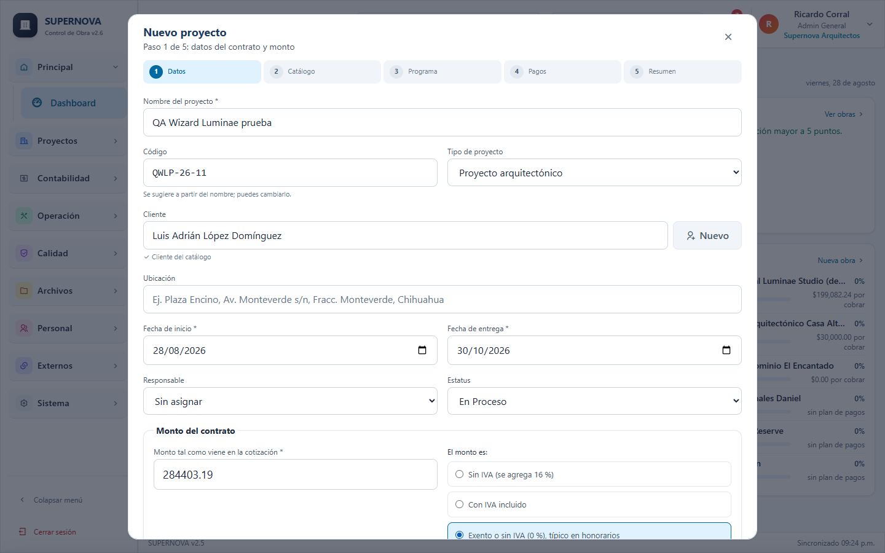

**Paso 1, Datos y monto.** Nombre, codigo (se sugiere solo), cliente (elige uno del catalogo o crea uno con el boton *Nuevo*), tipo de proyecto, fechas de inicio y entrega, responsable y el monto **tal como viene en la cotizacion**: marca si es *sin IVA* (se agrega 16 %), *con IVA incluido* o *exento* (tipico en honorarios). La vista previa muestra subtotal, IVA y total antes de guardar. *Guardar y continuar* crea la obra; *Guardar y salir* la deja para despues.

**Paso 2, Catalogo.** Tres opciones:

- *Importar archivo*: arrastra el XLSX o CSV exportado de OPUS 24, Neodata o Excel. Se reconocen las columnas Clave, Descripcion, Unidad, Cantidad y P.U. sin importar mayusculas ni acentos; las filas sin cantidad se toman como partidas. Puedes corregir cualquier celda en la vista previa.
- *Formato de OPUS*: el sistema entiende las claves de OPUS (01-PRE para la partida y 01-PRE-105 para el concepto), asi que cada concepto cae en su partida aunque el archivo venga desordenado o sin los renglones de grupo. Si el exportado no trae encabezados, se usa el orden de columnas de OPUS: Clave, Concepto, Unidad, Cantidad, P.U. e Importe. El nombre del proyecto que OPUS escribe arriba de la tabla se muestra en la vista previa para que confirmes que es el archivo correcto.
- *Catalogo para cotizar*: si el archivo sale de OPUS sin precios (catalogo de concurso), se importa igual con claves, unidades y cantidades, y los precios se capturan despues. No se marca cada renglon como error.
- *Revisiones automaticas*: se avisa de claves repetidas, de renglones cuyo importe no coincide con cantidad por precio y de partidas cuyos conceptos no suman el subtotal del archivo. Las unidades se guardan como las escribe OPUS (M2, ML, PZA, LOTE).
- *Etapas de honorarios*: para proyectos arquitectonicos, de 2 a 4 etapas con porcentaje; se generan los conceptos ETAPA-A, ETAPA-B, etc.
- *Omitir por ahora*.

Si el catalogo no cuadra con el subtotal del contrato, agrega la fila *Descuento contractual* para que cierre.

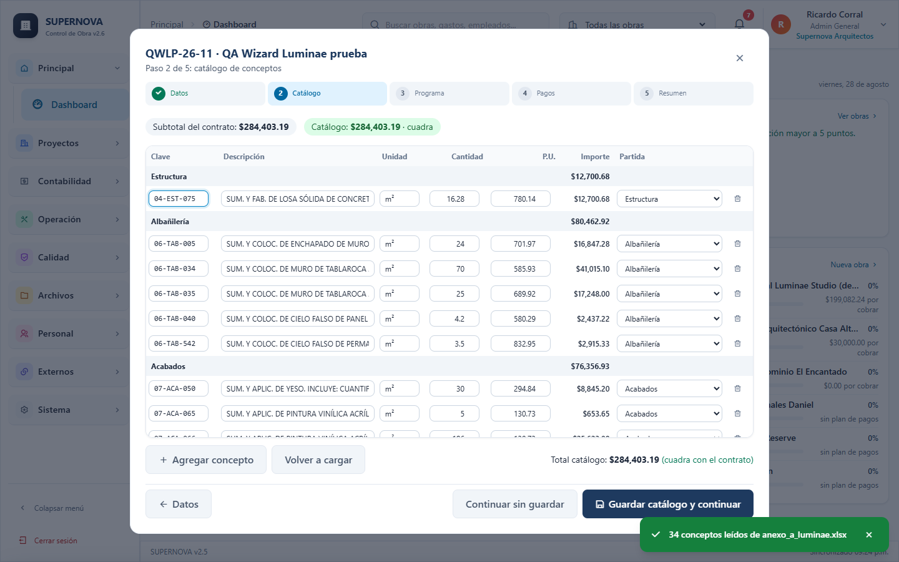

**Paso 3, Programa por semanas.** Ver 3.10.

**Paso 4, Plan de pagos.** Ver 3.9.

**Paso 5, Resumen.** Muestra que quedo creado y lo que falta; *Ir a la obra* abre la ficha.

Puedes volver al asistente en cualquier momento desde la ficha de la obra (por ejemplo, *Definir plan de pagos*) para completar lo que dejaste pendiente.

## 3.9 Plan de pagos y cobros

**Plan de pagos (paso 4 del asistente).** Elige una plantilla (*50-25-25*, *30-30-20-20*, *Pago unico*) o captura exhibiciones a mano: nombre, porcentaje o monto, fecha limite y condicion. La suma debe cerrar al total del contrato; el ultimo renglon absorbe los centavos. Marca *Ya recibi el anticipo* para registrar el primer cobro en el mismo paso. Cada exhibicion se convierte en una cuenta por cobrar y en un hito del programa.

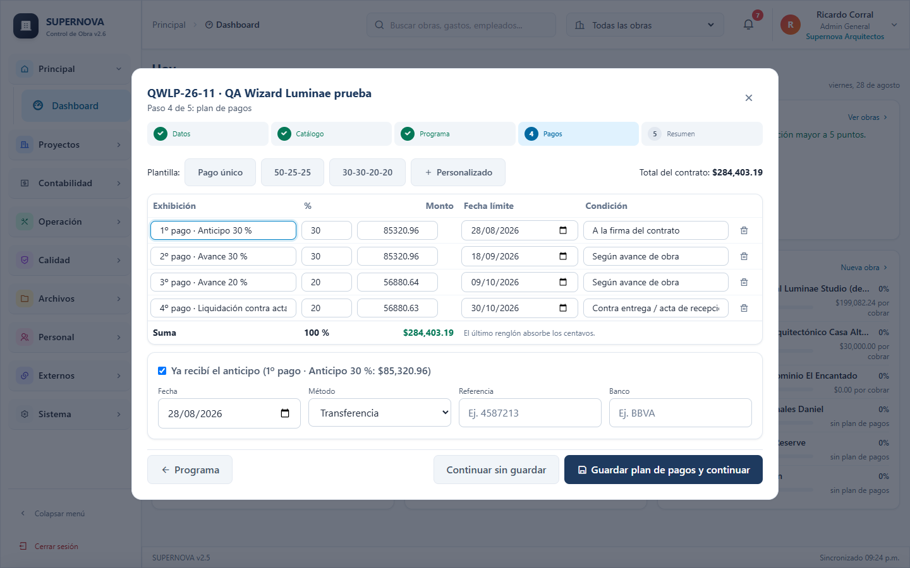

**Registrar un cobro.** Desde Pagos, la ficha de la obra, la ficha del cliente o el boton **+** del celular: elige la obra, el sistema muestra sus exhibiciones pendientes y preselecciona la mas antigua; captura monto, fecha, metodo y referencia. Si el monto excede el saldo de la exhibicion, puedes repartir el excedente en la siguiente. Al guardar aparece el folio (PR-000xx) y el saldo actualizado de la obra. Ya no es posible registrar un cobro sin cuenta por cobrar: si la obra no tiene plan, el sistema ofrece crear la cuenta por el total del contrato.

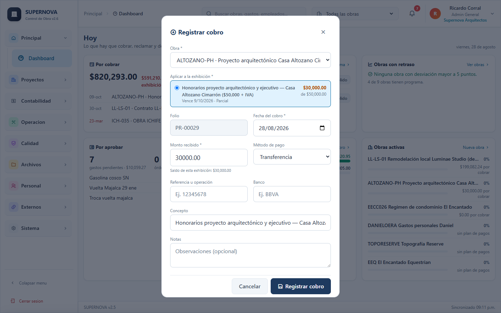

**Cobranza por obra.** En Pagos, la pestana *Por obra* muestra cada obra como una linea de tiempo con sus exhibiciones: verde pagada, ambar parcial, azul en ventana, rojo vencida. Filtros *Vencidas* y *Proximos 7 dias*. Un clic en un marcador abre el cobro preseleccionado.

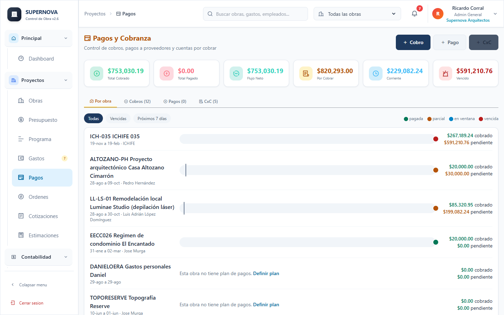

**Recibo en PDF.** En la lista de cobros, el icono PDF genera el recibo con membrete de la empresa, folio, cliente, obra, exhibicion, monto en numero y letra, metodo y linea de firma (archivo Recibo_PR-000xx_CODIGO.pdf).

## 3.10 Programa por semanas

**Definirlo (paso 3 del asistente).** Las columnas son las semanas entre la fecha de inicio y la de entrega; puedes elegir en que dia empieza la semana (por ejemplo viernes, como en los contratos de Supernova). Haz clic o arrastra sobre las semanas en que se ejecuta cada concepto; el porcentaje se reparte de forma uniforme y con *Editar porcentajes* lo ajustas a mano. *Agregar hito* crea entregas, aprobaciones o pagos con fecha y responsable (Nosotros, Cliente o Terceros). Al guardar se crea el programa contractual con una actividad por concepto (peso = importe / total) y los hitos.

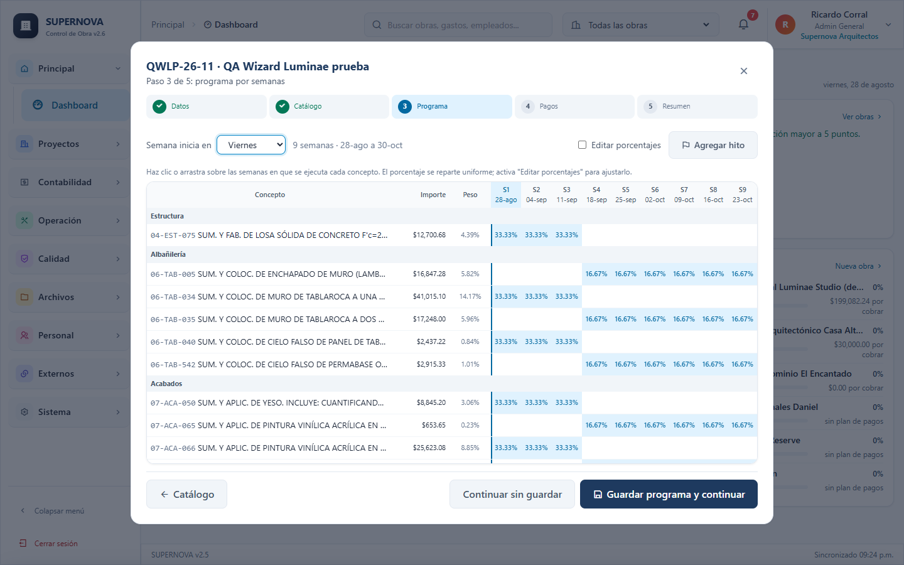

**Seguirlo (modulo Programa).** La pestana *Semanas* muestra la misma matriz en modo lectura, con la semana actual resaltada y una columna **Real %** por concepto: escribe el avance y se guarda solo (sin boton). Arriba se comparan el avance programado a la fecha, el real ponderado y la desviacion en puntos. Los hitos que dependen del cliente o de terceros se pintan en ambar con borde discontinuo; se marcan como cumplidos con su casilla. Las pestanas *Gantt* y *Curva S* siguen disponibles; el formulario completo de cada actividad se abre al hacer clic en su nombre.

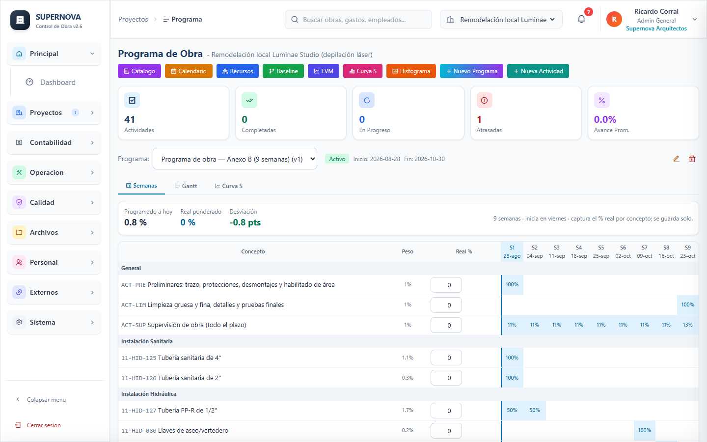

**Ficha de obra.** Al hacer clic en el nombre de una obra se abre su ficha: contrato (monto con o sin IVA), curva S con desviacion, hitos proximos, cobranza, gastos contra presupuesto, ultimas bitacoras y documentos, y acciones rapidas (Registrar cobro, Nuevo gasto, Nueva bitacora, Subir documento).

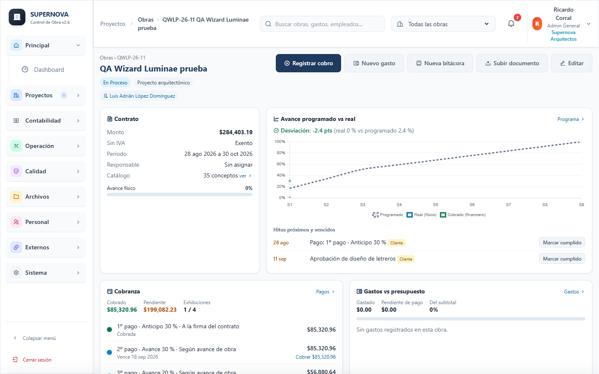

## 3.11 Captura desde el celular

En pantallas menores a 768 px el menu lateral se oculta y aparece la barra inferior con los cuatro modulos de tu rol (Residente: Bitacora, Fotos, Gastos, Programa; Gerente: Dashboard, Obras, Pagos, Programa; Contador: Pagos, Gastos, Nomina, Reportes) y un boton central **+** con la captura rapida.

**Bitacora rapida.** Toca **+** y *Nueva bitacora*: obra (se recuerda la ultima), fecha, que se hizo hoy, fotos desde la camara o la galeria (se comprimen a 1600 px antes de subir), clima, trabajadores y el avance real de hasta tres conceptos programados esta semana. Todo se guarda con un solo boton.

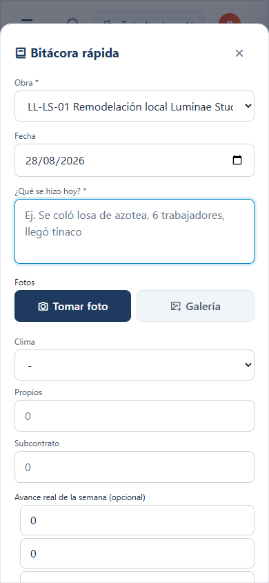

**Sin senal.** Si se cae la conexion, la bitacora, los gastos y las fotos se guardan en el telefono y en el encabezado aparece *N pendientes de enviar*. Se envian solos al volver la senal (o al tocar el indicador). Los datos no se pierden aunque cierres la aplicacion.

**Dashboard por rol.** La primera pantalla cambia segun quien entra: el gerente ve por cobrar, hitos en 7 dias, obras con retraso, gastos por aprobar y flujo del mes; el residente ve si falta la bitacora de hoy, fotos, gastos por comprobar y el avance de la semana; el contador ve cuentas vencidas, cobros de la semana, facturas sin pagar y nomina del periodo. Con **Ctrl+K** se busca cualquier modulo, obra o cliente.

# PARTE 4: Referencia de Modulos

Referencia tecnica de cada uno de los 33 modulos, organizados por categoria.

---

## Categoria: Proyectos

### 4.1 Dashboard

**Codigo interno:** `d` | **Icono:** ri-dashboard-3-line

**Proposito:** Vista ejecutiva con indicadores clave de rendimiento (KPIs) de toda la operacion.

**Contenido:**

**Tarjetas de KPI (10 indicadores):**

| KPI | Formula | Color |
|-----|---------|-------|
| Presupuesto Total | Suma de presupuesto_total de obras activas | Azul |
| Gastos Totales | Suma de monto_neto de todos los gastos | Rojo |
| Saldo Disponible | Presupuesto - Gastos | Verde (positivo) / Rojo (negativo) |
| % Utilizado | (Gastos / Presupuesto) x 100 | Amarillo |
| Gastos Pagados | Conteo y suma de gastos con estatus "Pagado" | Verde |
| Gastos Pendientes | Conteo y suma de gastos con estatus "Pendiente" | Naranja |
| Gasto/Dia (30d) | Suma gastos ultimos 30 dias / 30 | Gris |
| OC Pendientes | Conteo de OC con estatus "Pendiente" | Rojo |
| Empleados Activos | Total de empleados activos | Azul |
| Bitacoras Hoy | Entradas de bitacora con fecha de hoy | Verde |

**Graficas:**
- **Por Categoria (Dona):** Distribucion porcentual de gastos por categoria
- **Por Estatus (Barras):** Comparacion visual Pagados vs Pendientes vs Cancelados
- **Ultimos 7 dias (Linea):** Tendencia de gasto diario

**Alertas dinamicas:**
- Presupuesto utilizado >= 80%
- Ordenes de compra pendientes de aprobacion
- Obras con fecha de fin en los proximos 30 dias
- Obras con retraso (fecha fin < hoy y estatus activa)
- Bitacoras no registradas hoy
- Declaraciones REPSE proximas a vencer
- Pagos SUA proximos o vencidos

**Actualizacion:** Cada 3 segundos automaticamente.

---

### 4.2 Obras

**Codigo interno:** `o` | **Icono:** ri-building-2-line

**Proposito:** Gestionar los proyectos de construccion de la empresa.

**Campos del formulario:**

| Campo | Tipo | Requerido | Notas |
|-------|------|-----------|-------|
| Nombre | Texto | Si | Nombre del proyecto |
| Codigo | Texto | Auto | Generado por sistema |
| Estatus | Selector | Si | Activa, En Proceso, Pausada, Completada, Cancelada |
| Presupuesto Total | Numero | Si | Con IVA incluido |
| Zona Fiscal | Selector | Si | Normal 16%, Frontera 8%, Exento 0% |
| Avance | Numero | Auto | Calculado del programa Gantt |
| Fecha Inicio | Fecha | Si | - |
| Fecha Fin Estimada | Fecha | Si | >= Fecha Inicio |
| Responsable | Selector | No | De lista de empleados |
| Cliente | Texto | No | - |
| Ubicacion | Texto | No | Direccion completa |
| Descripcion | Textarea | No | - |

**Estatus y su significado:**
- **Activa:** Obra en planeacion o licitacion
- **En Proceso:** Obra en ejecucion fisica
- **Pausada:** Obra detenida temporalmente
- **Completada:** Obra terminada y entregada
- **Cancelada:** Obra abandonada

**Vista de lista:** Muestra todas las obras con nombre, estatus, presupuesto, avance y responsable.

---

### 4.3 Presupuesto

**Codigo interno:** `p` | **Icono:** ri-money-dollar-circle-line

**Proposito:** Control de presupuesto por obra con partidas detalladas y modificaciones.

**KPIs del modulo:**
- Presupuestado total (formato abreviado: $1.2M)
- Ejecutado total
- Disponible
- % Ejecutado (barra de progreso)
- Avance Promedio de obras

**Tabla comparativa:** Lista cada obra con:
- Presupuesto original
- Modificaciones (adicionales y deductivas)
- Presupuesto vigente
- Gasto acumulado
- Disponible
- Eficiencia (%)

**Modificaciones al presupuesto:**

| Campo | Descripcion |
|-------|-------------|
| Partidas Afectadas | Cuales partidas se modifican |
| Monto | Cantidad del cambio |
| Tipo | Adicional (+) o Deductiva (-) |
| Especificaciones | Justificacion del cambio |
| Aprobado Por | Quien autorizo |
| Fecha de Aprobacion | Cuando se autorizo |
| Estatus | Aprobada, Ejecutada |

**Graficas:**
- Comparativo presupuesto vs ejecutado por obra
- Top 5 categorias de gasto

**Exportacion:** Excel con detalle completo.

---

### 4.4 Programa

**Codigo interno:** `w` | **Icono:** ri-bar-chart-horizontal-line

**Proposito:** Programacion de obra con diagrama de Gantt y seguimiento de actividades.

**Campos del programa:**

| Campo | Descripcion |
|-------|-------------|
| Nombre del Programa | Identificador |
| Obra | Proyecto asociado |
| Fecha Inicio | Inicio general |
| Fecha Fin Estimada | Fin planificado |

**Campos de actividades:**

| Campo | Descripcion |
|-------|-------------|
| Nombre | Nombre de la actividad |
| Descripcion | Detalle |
| Fecha Inicio | Inicio de la actividad |
| Fecha Fin | Fin de la actividad |
| Duracion (dias) | Calculada de las fechas |
| Peso (%) | Importancia relativa |
| Avance (%) | Progreso actual |
| Responsable | Encargado |
| Orden | Posicion en la lista |
| Predecesora | Actividad previa requerida |

**Sincronizacion automatica:** La funcion `autoSyncAllAvances()` calcula el avance de cada obra como promedio ponderado de sus actividades y actualiza el campo `avance_porcentaje` de la obra.

---

### 4.5 Gastos

**Codigo interno:** `g` | **Icono:** ri-wallet-3-line

**Proposito:** Registro y seguimiento de todos los gastos de la empresa.

**Campos del formulario:**

| Campo | Tipo | Requerido | Notas |
|-------|------|-----------|-------|
| Obra | Selector | No | NULL = gasto administrativo |
| Descripcion | Texto | Si | - |
| Categoria | Selector | Si | Categorias configurables |
| Monto Bruto | Numero | Si | Antes de deducciones |
| IVA | Numero | Auto | Segun zona fiscal |
| Monto Neto | Numero | Auto | Despues de IVA |
| Estatus Pago | Selector | Si | Pendiente, Pagado, Cancelado |
| Fecha Solicitud | Fecha | Si | - |
| Folio Fiscal | Texto | No | UUID del CFDI |
| OC Relacionada | Selector | No | Vincula con orden de compra |
| Retenciones | Checkbox | No | ISR, IMSS, IVA |

**Calculos de IVA:**
- Normal: Monto Bruto x 0.16 = IVA (total = bruto + IVA)
- Frontera: Monto Bruto x 0.08 = IVA
- Exento: IVA = 0

**Gastos administrativos (sin obra):**
- Se pueden distribuir entre multiples obras
- El sistema abre modal de distribucion
- Cada obra recibe su porcion en su presupuesto

**Auto-actualizacion:** Cada 3 segundos en conjunto con el dashboard.

---

### 4.6 Pagos

**Codigo interno:** `pc` | **Icono:** ri-bank-card-line

**Proposito:** Gestion de pagos realizados a proveedores y contratistas.

**Informacion mostrada:**
- Lista de pagos realizados
- Monto y fecha de cada pago
- Proveedor y referencia bancaria
- Vinculacion con gasto u orden de compra
- Estatus del pago

**Flujo de pago:**
1. Se identifica el gasto pendiente de pago
2. Se registra la transferencia o cheque
3. Se actualiza el estatus del gasto a "Pagado"
4. Se vincula la referencia de pago

---

### 4.7 Ordenes de Compra

**Codigo interno:** `x` | **Icono:** ri-exchange-line

**Proposito:** Crear, aprobar y dar seguimiento a ordenes de compra.

**Campos del formulario:**

| Campo | Tipo | Requerido | Notas |
|-------|------|-----------|-------|
| Codigo Orden | Texto | Auto | OC-001, OC-002... |
| Proveedor | Selector | Si | De lista de proveedores |
| Obra | Selector | Si | Proyecto destino |
| Fecha Orden | Fecha | Si | - |
| Monto Estimado | Numero | Si | Mayor que 0 |
| Detalles | Textarea | No | Articulos y cantidades |
| Condiciones Pago | Texto | No | Terminos |
| Estatus | Selector | Auto | Pendiente, Aprobada, Cancelada |

**Flujo de aprobacion:**
- Se crea como "Pendiente"
- Gerente aprueba hasta $200,000 MXN
- Admin aprueba cualquier monto
- Al aprobar, puede crear gasto automaticamente

**Validacion:** El monto del gasto vinculado no puede exceder el monto de la OC.

---

### 4.8 Cotizaciones

**Codigo interno:** `ct` | **Icono:** ri-file-list-2-line

**Proposito:** Crear y gestionar cotizaciones de proveedores.

**Campos del encabezado:**

| Campo | Tipo | Requerido |
|-------|------|-----------|
| Obra | Selector | Si |
| Proveedor | Selector | Si |
| Numero Cotizacion | Texto | Si |
| Fecha Cotizacion | Fecha | Si |
| Fecha Vencimiento | Fecha | No |
| Notas | Textarea | No |
| Estatus | Selector | Si |

**Estatus disponibles:** Borrador, Enviada, Aceptada, Rechazada

**Partidas de cotizacion:**

| Campo | Descripcion |
|-------|-------------|
| Descripcion | Articulo cotizado |
| Cantidad | Unidades |
| Unidad | pza, kg, m3, etc. |
| Precio Unitario | Costo por unidad |
| Monto | Cantidad x Precio Unitario |

**Calculos automaticos:**
- Subtotal = Suma de montos de partidas
- IVA = Subtotal x Tasa IVA
- Total = Subtotal + IVA

---

### 4.9 Estimaciones

**Codigo interno:** `es` | **Icono:** ri-calculator-line

**Proposito:** Medicion de avance de obra para facturacion al cliente.

**Campos del encabezado:**

| Campo | Tipo | Requerido |
|-------|------|-----------|
| Obra | Selector | Si |
| Numero Estimacion | Numero | Si |
| Fecha Estimacion | Fecha | Si |
| Periodo Inicio | Fecha | Si |
| Periodo Fin | Fecha | Si |
| Monto del Periodo | Numero | Auto |
| Estatus | Selector | Si |

**Estatus:** Borrador → Enviada → Aprobada

**Partidas de estimacion:**

| Campo | Descripcion |
|-------|-------------|
| Descripcion | Concepto de trabajo |
| Cantidad | Volumen ejecutado |
| Precio Unitario | Precio por unidad |
| Monto | Cantidad x Precio Unitario |
| % Completado | Avance de la partida |

**Automatizacion al aprobar:**
Se crea CxC con monto = monto_periodo, estatus = "Pendiente", vencimiento = fecha + 30 dias.

---

## Categoria: Contabilidad

### 4.10 Contabilidad (antes «Panel fiscal»)

**Codigo interno:** `cb` | **Icono:** ri-pie-chart-2-line

**Proposito:** Dashboard de contabilidad con metricas fiscales consolidadas.

**KPIs mostrados:**
- Total Ingresos (estimaciones aprobadas)
- Total CxC Pendientes (cuentas por cobrar abiertas)
- ISR Causado (impuesto acumulado)
- IVA Trasladado (IVA cobrado)
- Retenciones Practicadas (total retenido)

**Graficas:**
- Tendencia mensual de ingresos
- Analisis de antigüedad de CxC (aging)
- Linea de tiempo de obligaciones fiscales

**Fuentes de datos:** estimaciones, cuentas_por_cobrar, retenciones, declaraciones_mensuales

---

### 4.11 Facturas CFDI

**Codigo interno:** `fc` | **Icono:** ri-bill-line

**Proposito:** Registro de facturas recibidas de proveedores.

**Campos:**

| Campo | Tipo | Validacion |
|-------|------|------------|
| Proveedor | Selector | Requerido |
| Obra | Selector | - |
| Numero Factura | Texto | Requerido |
| Fecha Emision | Fecha | - |
| Subtotal | Numero | - |
| IVA Trasladado | Numero | - |
| Retenciones ISR | Numero | - |
| Retenciones IVA | Numero | - |
| Total | Numero | - |
| Folio Fiscal (UUID) | Texto | 36 caracteres, formato UUID |
| Tipo Comprobante | Selector | Fiscal / No Fiscal |
| PDF URL | Texto | - |
| Estatus Pago | Selector | Pendiente, Parcial, Pagado |

**Validacion UUID:** Formato XXXXXXXX-XXXX-XXXX-XXXX-XXXXXXXXXXXX obligatorio para tipo "Fiscal" al registrar pago.

---

### 4.12 CFDIs Emitidos

**Codigo interno:** `ce` | **Icono:** ri-file-mark-line

**Proposito:** Registro de facturas emitidas a clientes.

**Campos:**

| Campo | Descripcion |
|-------|-------------|
| Numero Serie | Serie de la factura |
| Numero Folio | Folio secuencial |
| UUID | Identificador unico del CFDI |
| Fecha Emision | Cuando se emitio |
| Cliente RFC | RFC del cliente receptor |
| Cliente Razon Social | Nombre legal del cliente |
| Subtotal | Monto antes de impuestos |
| IVA Trasladado | IVA cobrado |
| Total | Monto final |
| Forma de Pago | Metodo de cobro |
| Estatus | Vigente / Cancelada |
| PDF URL | Enlace al documento |

---

### 4.13 Retenciones

**Codigo interno:** `rt` | **Icono:** ri-percent-line

**Proposito:** Control de retenciones de impuestos practicadas y recibidas.

**Tipos de retencion:**
- **ISR** - Impuesto Sobre la Renta
- **IVA** - Impuesto al Valor Agregado
- **IEPS** - Impuesto Especial sobre Produccion y Servicios

**Campos:**

| Campo | Descripcion |
|-------|-------------|
| Tipo Retencion | ISR, IVA, IEPS |
| Proveedor | A quien se retiene |
| Obra | Obra asociada |
| Comprobante Numero | Factura relacionada |
| Fecha Retencion | Cuando se practico |
| Monto Retenido | Cantidad retenida |
| Porcentaje | Tasa aplicada |
| Folio Fiscal | UUID del CFDI |
| Notas | Observaciones |

---

### 4.14 Declaraciones

**Codigo interno:** `dc` | **Icono:** ri-file-chart-line

**Proposito:** Registro de declaraciones fiscales mensuales, trimestrales y anuales.

**Campos:**

| Campo | Descripcion |
|-------|-------------|
| Periodo | YYYY-MM |
| Ingresos Acumulados | Total de ingresos |
| Deducciones Autorizadas | Gastos deducibles |
| Coeficiente de Utilidad | Factor fiscal |
| ISR Causado | Impuesto generado |
| ISR Retenido por Clientes | ISR que retuvieron al cobrar |
| ISR a Pagar | Causado - Retenido |
| IVA Trasladado | IVA cobrado a clientes |
| IVA Acreditable | IVA pagado en compras |
| IVA a Pagar | Trasladado - Acreditable |
| Base Gravable | Monto base para calculo |

---

### 4.15 REPSE

**Codigo interno:** `rp` | **Icono:** ri-government-line

**Proposito:** Cumplimiento de declaraciones cuatrimestrales ante el IMSS por subcontratacion de servicios.

**Periodos cuatrimestrales:**
1. Enero - Abril
2. Mayo - Agosto
3. Septiembre - Diciembre

**Campos:**

| Campo | Descripcion |
|-------|-------------|
| Numero de Expediente | Referencia del REPSE |
| Periodo Cuatrimestre | 1ero, 2do, 3ero |
| Año | Ejercicio fiscal |
| Fecha Presentacion | Cuando se envio |
| Fecha Limite | Ultima fecha para enviar |
| Estatus | Pendiente, Presentada, Aceptada, Vencida |

**Tablas relacionadas:**
- `repse_contratos` - Contratos de subcontratacion vigentes
- `repse_documentos` - Documentacion requerida
- `repse_config_recordatorios` - Configuracion de alertas

**Alerta visual:** Banner rojo/ambar cuando faltan 15 dias o menos para el vencimiento. Multas: $56,570 - $226,280 por periodo no presentado.

---

### 4.16 SUA

**Codigo interno:** `su` | **Icono:** ri-bank-card-line

**Proposito:** Control de pagos mensuales de cuotas IMSS, Infonavit y RCV.

**Campos:**

| Campo | Descripcion |
|-------|-------------|
| Numero Registro | Identificador del pago |
| Periodo | Mes y año (YYYY-MM) |
| Año | Ejercicio |
| Fecha Pago | Cuando se pago |
| Fecha Limite | Ultimo dia sin recargos |
| Monto Total | Suma de todas las cuotas |
| Estatus | Pendiente, Pagado, Vencido |

**Tablas relacionadas:**
- `sua_conceptos` - Detalle de conceptos incluidos
- `sua_documentos` - Comprobantes de pago
- `sua_parametros` - Configuracion de tasas

**Alerta visual:** Banner azul/morado con advertencia de recargos del 1.47% mensual por pagos atrasados.

---

## Categoria: Operacion

### 4.17 Subcontratos

**Codigo interno:** `s` | **Icono:** ri-team-line

**Proposito:** Gestion de trabajos subcontratados y seguimiento de avance.

**Campos:**

| Campo | Tipo | Requerido |
|-------|------|-----------|
| Codigo | Texto | Auto (SC-001) |
| Obra | Selector | Si |
| Nombre del Trabajo | Texto | Si |
| Descripcion | Textarea | No |
| Tipo de Trabajo | Selector | No |
| Fecha Inicio | Fecha | No |
| Fecha Fin Estimada | Fecha | No |
| Fecha Fin Real | Fecha | No |
| Monto Contrato | Numero | No |
| Monto Pagado | Numero | No |
| % Avance | Numero | No |
| Estatus | Selector | Si |
| Responsable | Texto | No |
| Contacto Subcontratista | Texto | No |

**Estatus:** Pendiente, Activo, Completado, Suspendido, Cancelado

**Filtros disponibles:** Por estatus, tipo de trabajo, obra

---

### 4.18 Materiales

**Codigo interno:** `m` | **Icono:** ri-archive-line

**Proposito:** Control de inventario de materiales de construccion.

**Campos:**

| Campo | Tipo | Requerido |
|-------|------|-----------|
| Codigo | Texto | No |
| Nombre | Texto | Si |
| Descripcion | Textarea | No |
| Categoria | Selector | No |
| Unidad | Selector | No (pza, kg, m3, m2, lt) |
| Stock Actual | Numero | No |
| Stock Minimo | Numero | No |
| Precio Unitario | Numero | No |
| Proveedor | Selector | No |
| Obra | Selector | No |
| Estatus | Auto | Disponible, Bajo Stock, Agotado, Descontinuado |

**Indicadores de stock:**
- Verde: stock > minimo
- Ambar: stock <= minimo
- Rojo: stock = 0

**Movimientos de inventario:**

| Campo | Descripcion |
|-------|-------------|
| Tipo | Entrada, Salida, Ajuste |
| Cantidad | Unidades movidas |
| Fecha | Cuando se registro |
| Referencia | Documento de soporte |
| Notas | Observaciones |

**Calculo:** Valor del inventario = Suma(Stock x Precio Unitario) por cada material

---

### 4.19 Bitacora

**Codigo interno:** `b` | **Icono:** ri-book-2-line

**Proposito:** Registro diario de actividades, personal y condiciones en obra.

**Campos:**

| Campo | Tipo | Requerido |
|-------|------|-----------|
| Obra | Selector | Si |
| Fecha | Fecha | Si |
| Trabajadores Propios | Numero | No |
| Trabajadores Subcontrato | Numero | No |
| Tiempo Promedio (hrs) | Numero | No |
| Clima | Selector | No |
| Actividades | Textarea | No |
| Materiales Utilizados | Textarea | No |
| Maquinaria | Textarea | No |
| Incidentes | Textarea | No (borde rojo) |
| Observaciones | Textarea | No |

**Opciones de clima:** Soleado, Nublado, Lluvia, Niebla

**KPIs:** Total trabajadores, conteo de incidentes, promedios semanales

---

### 4.20 Calendario

**Codigo interno:** `c` | **Icono:** ri-calendar-line

**Proposito:** Programacion de eventos, juntas, inspecciones y entregas.

**Campos:**

| Campo | Tipo | Requerido |
|-------|------|-----------|
| Tipo | Selector | Si |
| Titulo | Texto | Si |
| Descripcion | Textarea | No |
| Fecha Inicio | Fecha/Hora | Si |
| Fecha Fin | Fecha/Hora | No |
| Ubicacion | Texto | No |
| Responsable | Texto | No |
| Obra | Selector | No |
| Estatus | Selector | Si |
| Notas | Textarea | No |

**Tipos de evento:** Junta, Inspeccion, Entrega, Mantenimiento, Otro

**Estatus:** Programado, Cancelado, Completado

**Vista:** Calendario mensual/semanal con codificacion de colores por tipo de evento.

---

## Categoria: Calidad

### 4.21 RFIs

**Codigo interno:** `r` | **Icono:** ri-questionnaire-line

**Proposito:** Solicitudes de informacion tecnica entre participantes del proyecto.

**Campos:**

| Campo | Tipo | Requerido |
|-------|------|-----------|
| Numero RFI | Texto | Auto |
| Obra | Selector | Si |
| Fecha Emision | Fecha | Si |
| Enviado a | Texto | No |
| Pregunta | Textarea | Si |
| Adjuntos | Archivo | No |
| Fecha Respuesta Esperada | Fecha | No |
| Respuesta | Textarea | No |
| Fecha Respuesta Actual | Fecha | No |
| Estatus | Selector | Si |

**Estatus:** Enviada → En Revision → Respondida → Cerrada

**Exportacion:** Excel con historial completo de RFIs.

---

### 4.22 Punch List

**Codigo interno:** `u` | **Icono:** ri-checkbox-circle-line

**Proposito:** Seguimiento de deficiencias y trabajos pendientes de correccion.

**Campos:**

| Campo | Tipo | Requerido |
|-------|------|-----------|
| Numero Item | Texto | Auto |
| Obra | Selector | Si |
| Descripcion | Textarea | Si |
| Area | Texto | No |
| Severidad | Selector | Si |
| Responsable | Texto | No |
| Fecha Limite | Fecha | No |
| Estado | Selector | Si |
| Fecha Cierre | Fecha | No |
| Notas de Cierre | Textarea | No |
| Fotos | Archivo | No |

**Severidad:** Critica, Mayor, Menor

**Estado:** Abierta → En Progreso → Cerrada

---

### 4.23 Seguridad

**Codigo interno:** `y` | **Icono:** ri-verified-badge-line

**Proposito:** Registro y seguimiento de incidentes de seguridad en obra.

**Campos:**

| Campo | Tipo | Requerido |
|-------|------|-----------|
| Numero Incidente | Texto | Auto |
| Obra | Selector | Si |
| Fecha Incidente | Fecha | Si |
| Hora Incidente | Hora | No |
| Tipo Incidente | Selector | Si |
| Descripcion | Textarea | Si |
| Personas Involucradas | Texto | No |
| Lesionados | Texto | No |
| Gravedad | Selector | Si |
| Medidas Tomadas | Textarea | No |
| Investigador | Texto | No |
| Fotos | Archivo | No |
| Estado | Selector | Si |

**Tipos:** Accidente, Cuasi-Accidente, Incidente Peligro, Enfermedad Ocupacional

**Gravedad:** Leve, Moderada, Grave, Fatal

**Estado:** Reportado → Investigado → Cerrado

---

## Categoria: Archivos

### 4.24 Documentos

**Codigo interno:** `k` | **Icono:** ri-folder-3-line

**Proposito:** Almacenamiento y organizacion de documentos del proyecto.

**Campos:**

| Campo | Tipo | Requerido |
|-------|------|-----------|
| Nombre | Texto | Si |
| Tipo | Selector | Si |
| Archivo | Upload | No |
| Liga externa | URL | No |
| Obra | Selector | No |
| Categoria | Selector | Si |
| Entrega del programa | Selector | No |
| Visible para el cliente | Casilla | No |
| Fecha del documento | Fecha | No |
| Descripcion | Textarea | No |
| Version | Numero | No |
| Responsable | Auto | Usuario actual |

**Tipos de documento:** Planos, Especificaciones, Permisos, Contratos, Reportes, Otro

**Archivo o liga:** puedes subir el archivo (hasta 25 MB) o pegar una liga de Drive o Dropbox. Si subes
el archivo, se guarda en un almacen privado y solo se abre con una liga firmada que caduca en 5 minutos.

**Visible para el cliente:** deja la casilla vacia salvo que quieras que ese documento aparezca en el
portal del cliente de esa obra. Tambien puedes prenderlo y apagarlo desde la lista con el icono del ojo.
Los documentos sin obra asignada nunca se publican.

**Entrega del programa:** elige el hito al que pertenece el documento. En el portal, el cliente ve los
entregables agrupados bajo su entrega, con la fecha y el estado de cada una, y en el programa de obra le
aparece un boton que lo lleva directo a esa entrega. La lista solo muestra los hitos de la obra elegida;
si la obra todavia no tiene programa, el selector te lo dice. Lo que dejes sin entrega asignada cae en
*Otros documentos*, al final de la tarjeta.

**Almacenamiento:** Supabase Storage con acceso controlado por empresa.

---

### 4.25 Fotos

**Codigo interno:** `f` | **Icono:** ri-image-line

**Proposito:** Galeria fotografica de avance de obra y documentacion visual.

**Campos:**

| Campo | Tipo | Requerido |
|-------|------|-----------|
| Titulo | Texto | No |
| Descripcion | Textarea | No |
| Obra | Selector | No |
| Fecha Foto | Fecha | No |
| Archivo | Upload imagen | Si |
| Tags | Texto | No |
| Categoria | Selector | No |
| Entrega del programa | Selector | No |

**Categorias:** Avance, Incidente, Documento, Otro

**Entrega del programa:** igual que en Documentos. Las fotos que asignes a un hito acompanan a esa
entrega en el portal del cliente; las demas siguen en la galeria general, que pasa a llamarse *Mas fotos
de la obra* cuando ya hay fotos repartidas por entrega.

**Limites:** PNG o JPG, maximo 2MB por imagen

**Funcionalidades:**
- Vista de linea de tiempo (timeline)
- Filtro por mes y obra
- Carga por lotes (batch upload)
- Indicador de fotos por mes

---

## Categoria: Personal

### 4.26 Empleados

**Codigo interno:** `e` | **Icono:** ri-user-star-line

**Proposito:** Gestion del personal de la empresa con datos laborales y de seguridad social.

**Campos principales:**

| Campo | Tipo | Requerido |
|-------|------|-----------|
| Nombre Completo | Texto | Si |
| Puesto | Texto | No |
| Sueldo Base | Numero | No |
| Telefono | Telefono | No |
| Email | Email | No |
| Obra Asignada | Selector | No |
| Fecha Ingreso | Fecha | No |
| Notas | Textarea | No |

**Modal de Datos IMSS:**

| Campo | Descripcion |
|-------|-------------|
| NSS (Afiliacion) | Numero de Seguro Social |
| Numero de Credito | Credito de vivienda |
| Fecha de Afiliacion | Alta en IMSS |
| Tipo de Regimen | Regimen de seguridad social |
| Credito Infonavit | Numero de credito Infonavit |
| Correo IMSS | Email registrado ante IMSS |

**Indicadores:**
- Insignia "Con IMSS" cuando datos estan completos
- Conteo: "X con IMSS / Y total empleados"
- Filtro por obra asignada
- Filtro por estatus (activo/inactivo)

---

### 4.27 Nomina

**Codigo interno:** `n` | **Icono:** ri-money-dollar-box-line

**Proposito:** Calculo y control de pagos de nomina a empleados.

**Campos:**

| Campo | Tipo | Requerido |
|-------|------|-----------|
| Empleado | Selector | Si |
| Tipo Periodo | Selector | Si |
| Periodo Inicio | Fecha | Si |
| Periodo Fin | Fecha | Si |
| Dias Trabajados | Numero | Si |
| Sueldo Bruto | Numero | Si |
| Bonificacion | Numero | No |
| Premios | Numero | No |
| Comisiones | Numero | No |
| Total Percepciones | Numero | Auto |
| Seguro Social | Numero | Auto |
| Infonavit | Numero | Auto |
| ISR | Numero | Auto |
| Otras Deducciones | Numero | No |
| Total a Pagar | Numero | Auto |
| Estatus | Selector | Si |
| Fecha Pago | Fecha | No |
| Notas | Textarea | No |

**Tipos de periodo:** Semanal, Quincenal, Mensual

**Estatus:** Borrador → Pendiente → Pagado / Cancelado

**Formulas:**
- Total Percepciones = Sueldo Bruto + Bonificacion + Premios + Comisiones
- Total Deducciones = Seguro Social + Infonavit + ISR + Otras
- Total a Pagar = Total Percepciones - Total Deducciones

**Operaciones masivas:** Seleccion multiple, cambio de estatus en bloque, eliminacion en bloque.

---

### 4.28 Asistencia

**Codigo interno:** `t` | **Icono:** ri-time-line

**Proposito:** Control de asistencia y horas trabajadas por empleado.

**Campos:**

| Campo | Tipo | Requerido |
|-------|------|-----------|
| Empleado | Selector | Si |
| Obra | Selector | No |
| Fecha | Fecha | Si |
| Hora Entrada | Hora | No |
| Hora Salida | Hora | No |
| Horas Trabajadas | Numero | Auto |
| Tipo | Selector | Si |
| Notas | Textarea | No |

**Tipos:** Presente, Ausente, Permiso, Incapacidad

**Calculo:** Horas Trabajadas = Hora Salida - Hora Entrada

**Filtros:** Por obra, empleado, tipo, rango de fechas

---

## Categoria: Externos

### 4.29 Proveedores

**Codigo interno:** `v` | **Icono:** ri-store-2-line

**Proposito:** Directorio de proveedores con datos comerciales, fiscales y bancarios.

**Pestaña General:**

| Campo | Requerido |
|-------|-----------|
| Razon Social | Si |
| Nombre Comercial | No |
| RFC | Si |
| Regimen Fiscal | No |
| Actividad Principal | No |
| Descripcion | No |

**Pestaña Contacto:**

| Campo | Descripcion |
|-------|-------------|
| Contacto Principal | Nombre del representante |
| Puesto del Contacto | Cargo |
| Telefono Contacto | Telefono directo |
| Email Contacto | Email directo |
| Telefono Empresa | Telefono general |
| Email Empresa | Email general |
| Direccion | Calle y numero |
| Ciudad | Ciudad |
| Estado | Estado |
| Codigo Postal | C.P. |

**Pestaña Bancaria:**

| Campo | Descripcion |
|-------|-------------|
| Banco | Institucion bancaria |
| Cuenta | Numero de cuenta |
| CLABE | Clave bancaria estandarizada |
| Titular | Nombre del titular de la cuenta |
| RFC Titular | RFC del titular |

**Pestaña Fiscal:**

| Campo | Descripcion |
|-------|-------------|
| Uso CFDI | Clave de uso (G03, G01, etc.) |
| Regimen Fiscal | Regimen SAT |

**Estatus:** Activo, Inactivo, Bloqueado

---

### 4.30 Clientes

**Codigo interno:** `l` | **Icono:** ri-user-heart-line

**Proposito:** Directorio de clientes con datos de contacto y saldos pendientes.

**Campos:**

| Campo | Tipo | Requerido |
|-------|------|-----------|
| Tipo | Selector | Si |
| Nombre | Texto | Si |
| RFC | Texto | No |
| Razon Social | Texto | No (para empresas) |
| Email | Email | Si |
| Telefono | Telefono | No |
| Contacto | Texto | No |
| Puesto Contacto | Texto | No |
| Direccion | Texto | No |
| Ciudad | Texto | No |
| Estado | Texto | No |
| Codigo Postal | Texto | No |
| Estatus | Selector | Si |
| Saldo Pendiente | Numero | Auto |
| Notas | Textarea | No |

**Tipos:** Persona (individual), Empresa (corporativo)

**Estatus:** Activo, Prospecto, Inactivo

**Estadisticas del modulo:**
- Total de clientes
- Activos / Prospectos / Inactivos
- Distribucion por tipo
- Saldo pendiente total

**Filtros:** Por tipo, estatus, busqueda por nombre

---

## Categoria: Sistema

### 4.31 Reportes

**Codigo interno:** `q` | **Icono:** ri-bar-chart-box-line

**Proposito:** Generacion y exportacion de reportes consolidados.

**Tipos de reporte disponibles:**

| Reporte | Descripcion |
|---------|-------------|
| Reporte General | Vision completa de la empresa |
| Reporte de Gastos | Detalle de gastos por categoria, obra, estatus |
| Analisis de Presupuesto | Comparativo presupuestado vs ejecutado |
| Avance de Obras | Progreso de cada proyecto |
| Resumen de Nomina | Totales de percepciones y deducciones |
| Resumen Fiscal | IVA, ISR, retenciones |

**Funciones de exportacion:**
- `exportarGastosExcel()` - Gastos a Excel
- `exportarOrdenesExcel()` - Ordenes de compra a Excel
- `exportPresupuesto()` - Presupuesto a Excel
- `exportarRfiExcel()` - RFIs a Excel
- `exportarClientesExcel()` - Clientes a Excel
- `generarReporteGeneral()` - Reporte completo en PDF

**Formatos de exportacion:** Excel (XLSX) y PDF

**Filtros:** Por obra, rango de fechas, categoria

---

### 4.32 Configuracion

**Codigo interno:** `z` | **Icono:** ri-settings-4-line

**Proposito:** Configuracion general de la empresa y del sistema.

**Pestaña Identidad:**

| Campo | Descripcion |
|-------|-------------|
| Nombre Comercial | Como se conoce la empresa (requerido) |
| Razon Social | Nombre legal |
| Giro | Tipo de actividad |
| Representante Legal | Nombre completo |
| Descripcion | Sobre la empresa |

**Pestaña Contacto:**

| Campo | Descripcion |
|-------|-------------|
| Telefono | Telefono de la empresa |
| Email | Email general |
| Direccion | Domicilio fiscal |
| Ciudad | Ciudad |
| Estado | Estado |
| Codigo Postal | C.P. |

**Pestaña Fiscal:**

| Campo | Descripcion |
|-------|-------------|
| RFC | 13 caracteres, mayusculas |
| Regimen Fiscal | Lista SAT (601-626) |
| Logo | Imagen PNG/JPG, max 2MB, recomendado 200x200px |

**Pestaña Bancaria:**

| Campo | Descripcion |
|-------|-------------|
| Banco | Nombre de la institucion |
| Cuenta | Numero de cuenta |
| CLABE | Clave Bancaria Estandarizada |

**Opciones adicionales del sistema:**
- Categorias de Gasto: Crear, editar y eliminar categorias personalizadas
- Tasa de IVA predeterminada
- Plantillas de condiciones de pago
- Moneda (MXN por defecto)
- Tema visual (Oscuro / Claro)
- Notificaciones (activar / desactivar)

---

### 4.33 Usuarios

**Codigo interno:** `h` | **Icono:** ri-user-settings-line

**Proposito:** Gestion de usuarios, roles, permisos y asignacion de obras.

**Pestaña Datos Basicos:**

| Campo | Descripcion |
|-------|-------------|
| Nombre | Nombre completo (requerido) |
| Email | Correo electronico unico (requerido) |
| Rol | Seleccionar de los 7 roles disponibles |
| Obras Asignadas | Checkboxes de obras disponibles |

**Pestaña Permisos (personalizacion):**

Permisos configurables por modulo:

| Modulo | Acciones Disponibles |
|--------|---------------------|
| Gastos | Ver, Crear, Editar, Eliminar |
| Obras | Ver, Crear, Editar |
| Empleados | Ver, Crear, Editar, Eliminar |
| Presupuesto | Ver, Crear, Editar |
| Reportes | Ver, Exportar |
| Usuarios | Ver, Crear, Editar, Eliminar |
| Configuracion | Ver, Editar |

**Botones de permisos:**
- **"Cargar permisos del rol"** - Restablece los permisos al valor predeterminado del rol
- **"Quitar todos"** - Elimina todos los permisos personalizados

**Nota:** "Los permisos base dependen del rol. Aqui puede personalizar permisos adicionales."

**Sistema de invitacion:**
- El administrador genera codigos de invitacion
- Formato: alfanumerico de 6 caracteres (ej: "ABC123")
- El nuevo empleado usa el codigo al registrarse en "Unirse a Empresa"
- Se le asigna rol "Trabajador" por defecto
- El admin puede cambiar el rol posteriormente

**Asignacion de obras:**
- Tabla `obra_asignaciones` (muchos a muchos)
- Usuarios nivel 100 (admin) ven todas las obras automaticamente
- Los demas ven solo las obras marcadas en sus checkboxes

---

# PARTE 5: Solucion de Problemas

## Problemas Comunes

### Login y Acceso

| Problema | Causa | Solucion |
|----------|-------|----------|
| "Cuenta bloqueada" | 3 intentos fallidos | Espera 15 minutos y vuelve a intentar |
| No puedo iniciar sesion | Contraseña incorrecta | Contacta a tu administrador para restablecer |
| Sesion cerrada inesperadamente | Token expirado | Inicia sesion nuevamente |
| No veo ninguna obra | Sin asignacion | Pide a tu admin que te asigne obras en Usuarios |
| No veo un modulo | Sin permisos | Pide a tu admin que revise tus permisos |

### Permisos

| Problema | Causa | Solucion |
|----------|-------|----------|
| "No tienes permiso" al intentar crear | Nivel insuficiente | Tu rol no permite crear. Pide al admin que ajuste permisos. |
| No puedo aprobar una OC | Nivel < 80 | Solo gerentes (80) y admins (100) pueden aprobar |
| No veo datos de otra obra | Sin asignacion | El admin debe asignarte a esa obra |
| No puedo editar configuracion | Nivel < 100 | Solo administradores pueden editar configuracion |

### Errores al Guardar

| Problema | Causa | Solucion |
|----------|-------|----------|
| "Error al guardar" generico | Problema de conexion | Verifica tu conexion a internet y reintenta |
| "Email ya existe" | Email duplicado | Usa un email diferente |
| Datos no aparecen despues de guardar | Cache desactualizada | Haz clic en "Actualizar" o presiona Ctrl+F5 |
| Formulario no se envia | Campo requerido vacio | Revisa los campos marcados en rojo |

### PDFs y Exportacion

| Problema | Causa | Solucion |
|----------|-------|----------|
| PDF en blanco | Sin datos para exportar | Verifica que hay datos con los filtros aplicados |
| Excel corrupto | Datos especiales | Limpia caracteres especiales en los campos |
| Logo no aparece en PDF | Logo no configurado | Sube el logo en Configuracion > Fiscal |

### Datos y Sincronizacion

| Problema | Causa | Solucion |
|----------|-------|----------|
| Datos desactualizados | Cache local | Haz clic en "Actualizar" en el modulo |
| Graficas no se muestran | Error de renderizado | Recarga la pagina (Ctrl+F5) |
| Datos de otra empresa | Error de sesion | Cierra sesion y vuelve a entrar |

## Validaciones del Sistema

### UUID / Folio Fiscal

- **Formato correcto:** `XXXXXXXX-XXXX-XXXX-XXXX-XXXXXXXXXXXX`
- **Longitud:** 36 caracteres incluyendo guiones
- **Ejemplo valido:** `A1B2C3D4-E5F6-7890-ABCD-EF1234567890`
- **Obligatorio** al pagar facturas de tipo "Fiscal"

### Validaciones Financieras

- Montos deben ser mayores que 0
- IVA bloqueado a 0%, 8% o 16% segun zona fiscal
- El presupuesto vigente (Original + Adicionales - Deductivas) debe ser > 0
- El gasto vinculado a una OC no puede exceder el monto de la OC
- Los periodos de nomina deben ser consecutivos (sin huecos)

### Validaciones de Datos Personales

- Email debe ser unico dentro de la empresa
- RFC: 13 caracteres (persona moral) o 12 (persona fisica)
- NSS: formato valido de Seguro Social
- Salario no puede ser menor al salario minimo vigente
- Fecha Fin debe ser igual o posterior a Fecha Inicio

### Limites de Archivos

| Tipo | Formato | Tamaño Maximo |
|------|---------|---------------|
| Fotos | PNG, JPG | 2 MB |
| Logo empresa | PNG, JPG | 2 MB (200x200px recomendado) |
| Documentos | PDF | 10 MB |
| Archivos comprimidos | ZIP, TAR, TAR.GZ | 50 MB |

## Mejores Practicas

### Nomenclatura Recomendada

- **Obras:** Incluir tipo y ubicacion - "Torre Reforma Piso 12", "Casa Hab. Fracc. Los Alamos L5"
- **Ordenes de compra:** El sistema genera automaticamente OC-001, OC-002, etc.
- **Subcontratos:** SC-001, SC-002 (automatico)
- **Documentos:** Incluir fecha y version - "Plano_Estructural_v2_2026-01"
- **Fotos:** Incluir area y fecha - "Cimentacion_Eje3_2026-01-15"

### Flujo de Aprobaciones

1. **Cotizacion** → Solicitar al menos 3 cotizaciones para comparar
2. **Orden de Compra** → Crear solo con cotizacion aceptada
3. **Aprobacion** → Respetar limites de monto por rol
4. **Gasto** → Siempre vincular a la OC correspondiente
5. **Pago** → Registrar con referencia bancaria y folio fiscal

### Respaldos y Seguridad

- Todos los datos se respaldan automaticamente en la nube (Supabase)
- La cache local tiene duracion de 24 horas
- Cierra sesion al terminar de usar un equipo compartido
- No compartas tu contraseña con otros usuarios
- Usa contraseñas de al menos 6 caracteres con mayusculas y numeros

### Organizacion del Trabajo Diario

1. **Inicio del dia:** Revisa el Dashboard para ver alertas y pendientes
2. **Durante el dia:** Registra bitacora, movimientos de materiales, asistencia
3. **Fin del dia:** Verifica que todo este registrado y sincronizado
4. **Semanal:** Revisa presupuesto vs ejecutado, estatus de OC pendientes
5. **Mensual:** Procesa nomina, declaraciones fiscales, REPSE si aplica

---

# PARTE 6: Glosario

## Terminos de Construccion

| Termino | Definicion |
|---------|-----------|
| **Adicional** | Incremento aprobado al presupuesto original de una obra |
| **Avance** | Porcentaje de obra ejecutada respecto al total programado |
| **Bitacora** | Registro diario de actividades, personal y condiciones en obra |
| **Deductiva** | Reduccion al presupuesto por trabajos eliminados o no ejecutados |
| **Estimacion** | Medicion del avance de obra en un periodo para fines de facturacion al cliente |
| **Frente** | Area o zona especifica de trabajo dentro de una obra |
| **Gantt** | Diagrama de barras que muestra la programacion de actividades en el tiempo |
| **Partida** | Linea o concepto individual dentro de un presupuesto (ej: "Cimentacion", "Muros") |
| **Predecesora** | Actividad que debe completarse antes de que otra pueda iniciar |
| **Punch List** | Lista de deficiencias o trabajos pendientes de correccion antes de la entrega |
| **Residente** | Ingeniero o arquitecto responsable de la supervision diaria en campo |
| **RFI** | Request for Information - Solicitud formal de informacion tecnica |
| **Ruta Critica** | Secuencia de actividades que determina la duracion minima del proyecto |
| **SBC** | Salario Base de Cotizacion - Base para calcular cuotas IMSS |
| **SDI** | Salario Diario Integrado - Incluye salario base mas prestaciones |
| **Subcontrato** | Contrato con un tercero para ejecutar un trabajo especifico |

## Terminos Fiscales

| Termino | Definicion |
|---------|-----------|
| **CFDI** | Comprobante Fiscal Digital por Internet - Factura electronica oficial en Mexico |
| **CLABE** | Clave Bancaria Estandarizada - Codigo de 18 digitos para transferencias |
| **Coeficiente de Utilidad** | Factor fiscal que determina el impuesto provisional a pagar |
| **Declaracion** | Informe fiscal presentado ante el SAT con datos de ingresos e impuestos |
| **DIOT** | Declaracion Informativa de Operaciones con Terceros - Reporte mensual al SAT |
| **FONACOT** | Fondo Nacional para el Consumo de los Trabajadores - Prestamos a trabajadores |
| **IDSE** | IMSS Desde Su Empresa - Portal del IMSS para tramites patronales |
| **IEPS** | Impuesto Especial sobre Produccion y Servicios |
| **IMSS** | Instituto Mexicano del Seguro Social - Seguridad social de los trabajadores |
| **Infonavit** | Instituto del Fondo Nacional de la Vivienda para los Trabajadores |
| **ISR** | Impuesto Sobre la Renta - Impuesto federal sobre ingresos |
| **IVA** | Impuesto al Valor Agregado - 16% (normal), 8% (frontera), 0% (exento) |
| **IVA Acreditable** | IVA pagado en compras que se puede descontar del IVA cobrado |
| **IVA Trasladado** | IVA cobrado a clientes en ventas |
| **NSS** | Numero de Seguro Social - Identificador unico del trabajador ante IMSS |
| **PAC** | Proveedor Autorizado de Certificacion - Empresa que timbra CFDIs |
| **RCV** | Retiro, Cesantia y Vejez - Cuotas de ahorro para el retiro |
| **Regimen Fiscal** | Clasificacion tributaria de la empresa ante el SAT (ej: 601, 612, 626) |
| **REPSE** | Registro de Prestadoras de Servicios Especializados - Obligacion ante IMSS por subcontratacion |
| **Retencion** | Porcentaje de impuesto que se retiene al pagar a un proveedor |
| **RFC** | Registro Federal de Contribuyentes - Identificador fiscal en Mexico |
| **SAT** | Servicio de Administracion Tributaria - Autoridad fiscal de Mexico |
| **SUA** | Sistema Unico de Autodeterminacion - Software del IMSS para calcular cuotas patronales |
| **UUID** | Identificador Unico Universal - Folio fiscal que identifica cada CFDI |

## Terminos del Sistema

| Termino | Definicion |
|---------|-----------|
| **Cache** | Almacenamiento local temporal de datos para acceso rapido (duracion: 24 horas) |
| **CxC** | Cuentas por Cobrar - Montos que los clientes deben a la empresa |
| **Dashboard** | Panel principal con indicadores clave de rendimiento (KPIs) |
| **Empresa** | Organizacion/tenant - Cada empresa tiene datos aislados |
| **Filtro de Obra** | Selector global que filtra todos los datos por proyecto seleccionado |
| **KPI** | Key Performance Indicator - Indicador clave de rendimiento |
| **Modal** | Ventana emergente dentro de la aplicacion para formularios y detalles |
| **Modulo** | Seccion funcional de la aplicacion (ej: Gastos, Obras, Nomina) |
| **OC** | Orden de Compra - Documento formal de solicitud de compra a un proveedor |
| **Prorrateo** | Distribucion proporcional de un gasto entre varias obras |
| **Rol** | Perfil de usuario que define su nivel de acceso y permisos |
| **SPA** | Single Page Application - Aplicacion web de una sola pagina |
| **Sincronizacion** | Proceso de actualizar datos entre el navegador y el servidor |
| **Token** | Clave de sesion que identifica al usuario autenticado |

---

**Fin del Manual de Usuario**

Control de Obra - Plataforma de Gestion Integral para Empresas de Construccion

Para soporte tecnico, contacta a tu administrador de empresa.

## 3.12 Compras y gastos

Desde agosto de 2026 los modulos Gastos y Ordenes son uno solo: **Compras y gastos**. Cada gasto lleva un **destino**: *Obra* (se carga al costo de esa obra), *Indirecto* (renta, luz, telefonia, contador, publicidad: se reparte entre las obras activas con la regla de Configuracion > Finanzas) o *Socio* (gasto personal que pago la empresa; solo lo ven los administradores).

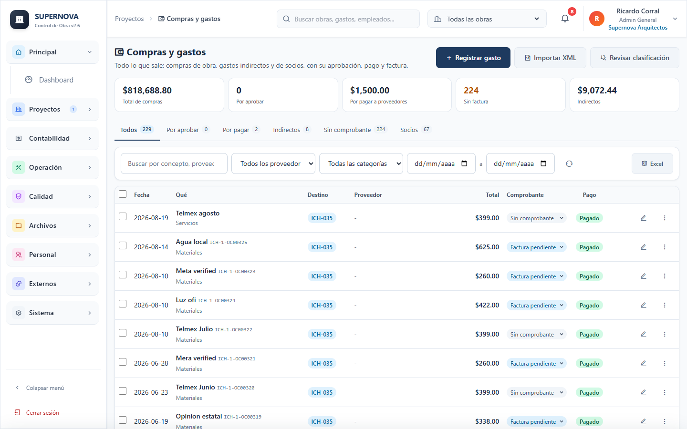

**Cada destino tiene su apartado.** Las pestanas separan por destino antes que por estado, para que el costo de obra no se mezcle con lo que no lo es:

| Pestana | Que trae | Obedece al selector de obra |
|---------|----------|------------------------------|
| **De obra** | Solo compras cargadas a una obra. Es la vista que abre el modulo. | Si |
| **Oficina (indirectos)** | Renta, luz, telefono, contador, dominios, publicidad. | No: son de la empresa |
| **Personales de socio** | Lo que la empresa pago por cuenta de un socio. Solo administradores. | No: son de la empresa |
| Por aprobar / Por pagar / Sin factura | Filtros de estado, sobre lo del contexto. | Si |
| Todos | Todo junto, para buscar. | Si |

Antes, al elegir una obra arriba, se colaban los indirectos y los gastos personales de socio porque no tienen obra asignada. Ya no: **De obra** muestra unicamente lo de esa obra. Los dos apartados de empresa llevan arriba una nota que explica que son de la empresa y no cambian con la obra que elijas, con su total y a donde va ese dinero (el prorrateo a las obras, o la cuenta corriente del socio).

En el tablero de arriba, *Compras de esta obra* cambia con la obra elegida, mientras que *Oficina* y *Personales de socio* siempre suman toda la empresa; la etiqueta lo dice.

**Registrar gasto.** Cinco datos: que se compro, total pagado (marca *Incluye IVA 16 %* si viene desglosado), destino, proveedor (escribe para buscar o crearlo) y fecha. La categoria se sugiere sola a partir de la descripcion y el proveedor; si el sistema detecta que un gasto capturado como obra parece de oficina (Telmex, Meta, luz) lo propone como indirecto y basta un clic para aceptarlo. En *Mas detalles* estan la partida del catalogo, el estado de pago con su fecha de vencimiento, el numero de factura y el UUID.

**Todo nace pendiente.** Un gasto recien capturado queda como *Por pagar*, aunque el dinero ya haya salido. Nadie lo da por saldado por ti: alguien tiene que moverlo a *Pagado* a mano. Asi el sistema sabe en todo momento cuanto se debe de verdad, sea al proveedor o a quien puso el dinero de su bolsa. Si el gasto ya estaba pagado al momento de capturarlo, cambia el campo *Pago* a **Ya se pago** en el formulario.

**Cambiar el estado desde la lista.** La burbuja de la columna *Pago* es un selector: tocala y elige *Por aprobar*, *Por pagar* o *Pagado*, sin abrir el gasto. Al marcarlo pagado se da por cubierto el total; al regresarlo a *Por pagar* se limpia lo cobrado. Si el gasto ya tiene pagos capturados en el modulo de Pagos, la burbuja no lo deja regresar a pendiente: primero hay que cancelar el pago, para que las dos cuentas no se contradigan. La misma burbuja aparece en las tarjetas del celular.

**Quien puso el dinero.** Si un socio pago de su bolsa, eligelo en *Quien puso el dinero*: el gasto cuenta para la obra y ademas queda como aportacion en la cuenta corriente del socio, para reembolsarlo o descontarlo en el reparto.

**Dinero por reponer (caja chica).** Arriba de la lista aparece un bloque ambar con lo que cada persona puso de su bolsa y todavia no se le repone: cuantos gastos son y cuanto suman. Es el conteo que sirve al cierre de obra, cuando se devuelve lo que cada quien adelanto. El nombre filtra la lista a sus gastos (quita el filtro con la palomita de la burbuja *Pago...*), y *Marcar repuesto* pasa de un golpe todos sus gastos pendientes a pagados, previa confirmacion con el total. El bloque desaparece solo cuando no queda nada por reponer.

**Foto del ticket desde el celular.** Toca **+** y *Gasto con ticket*: se abre la camara, tomas la foto (se comprime antes de subir), capturas el total y la obra, y listo. Sin senal, el gasto y la foto esperan en el telefono y se envian solos al volver la conexion.

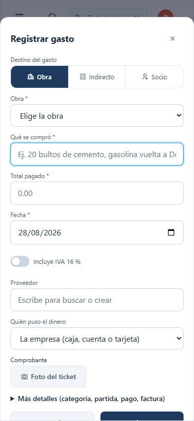

**Aprobacion.** Un residente puede registrar hasta $50,000 por gasto y un supervisor hasta $200,000; por arriba, el gasto queda en la pestana *Por aprobar* hasta que un gerente o administrador lo apruebe (uno por uno o en lote). Un rechazo pide motivo y se lo muestra a quien lo pidio en su dashboard.

**Comprobacion.** Cada gasto muestra su estado: *Sin comprobante*, *Ticket*, *Factura pendiente* o *Facturado*. Ya no hace falta el UUID para marcar un gasto como pagado: la factura se pide despues. En la pestana *Sin factura* selecciona varios y usa *Pedir factura*: se arma el mensaje de WhatsApp o correo con la lista de tickets y los datos fiscales de la empresa.

**Importar XML.** *Importar XML* acepta uno o varios archivos .xml o un .zip. Cada factura busca sola el gasto que le corresponde (RFC del proveedor, monto y fecha); confirmas y el gasto queda *Facturado* con su UUID, subtotal e IVA. Las facturas emitidas por la empresa se emparejan con los cobros.

**Revisar clasificacion.** El boton *Revisar clasificacion* (gerente o administrador) lista los gastos historicos cuya descripcion sugiere otra categoria o destino y permite corregirlos en lote.

**Orden de compra.** Solo cuando la necesitas: en el menu de un gasto con proveedor, *Generar orden de compra* crea el folio. Ya no se genera una OC automatica por cada gasto.

## 3.13 Pagos a proveedores, flujo y conciliacion

**Una sola formula.** El encabezado de Pagos muestra, para el periodo elegido, lo cobrado, lo pagado (pagos a proveedores, gastos pagados al momento, nomina y retiros de socios), el flujo neto, lo que hay por cobrar y por pagar, y el saldo de los proximos 30 dias. El dashboard y los reportes usan exactamente la misma formula.

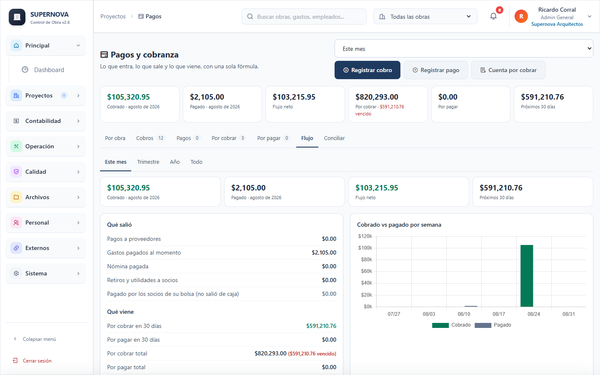

**Por pagar.** Los gastos pendientes aparecen agrupados por proveedor con su fecha de vencimiento (fecha del gasto mas los dias de credito del proveedor, o 30). Filtra *Vence esta semana* o *Vencidas*.

**Registrar pago.** Desde la pestana *Por pagar*, desde el gasto o desde la ficha del proveedor. Marca los gastos que cubre el pago y ajusta el monto aplicado si fue parcial; si pagas de mas, el excedente se aplica al siguiente gasto del proveedor o se registra como anticipo. Cada pago lleva folio PP-000xx y comprobante en PDF.

**Ficha del proveedor.** Un clic en el nombre abre su ficha: compras, pagos, saldo, CLABE con *Copiar datos de pago*, WhatsApp, facturas pendientes y los ultimos movimientos. *Estado de cuenta* exporta todo a Excel.

**Conciliar con el banco.** En Pagos > *Conciliar*, sube el CSV o XLSX de tu banca en linea. Cada abono se empareja con un cobro y cada cargo con un pago o gasto pagado (mismo monto y hasta 3 dias de diferencia; hasta 1 % de diferencia se marca como probable). Confirma y los registros quedan marcados como conciliados; lo que no exista en la app lo puedes registrar desde la misma fila.

## 3.14 Panel fiscal, cierre mensual y contador

**Panel fiscal.** Se calcula desde los gastos y cobros del periodo: IVA acreditable (solo gastos facturados y deducibles), IVA trasladado (de los CFDI emitidos importados o, si no hay, estimado de los cobros), IVA a pagar y retenciones. El bloque *Deducibilidad* separa lo facturado, lo que tiene ticket, lo que no tiene comprobante y lo no deducible; cada cifra abre la pestana correspondiente de Compras.

**Cierre mensual (Contabilidad > Cierres).** Cada mes muestra sus totales y una lista de pendientes (gastos sin categoria, facturas pendientes, compras por aprobar, indirectos sin repartir, movimientos sin conciliar). *Generar paquete* descarga un ZIP con gastos.xlsx, cobros.xlsx, pagos.xlsx, nomina.xlsx, retiros_socios.xlsx (solo administradores), resumen.pdf y la carpeta xml/ del mes; ademas deja una copia con enlace de 7 dias para enviarla al contador. *Cerrar mes* deja los registros del mes de solo lectura para el equipo; un administrador puede reabrirlo indicando el motivo.

**Contador externo.** El rol *contador_externo* consulta y exporta todo (Compras, Pagos, Panel fiscal, Cierres, Reportes) sin capturar ni editar, y no ve nada de socios. Se da de alta desde Usuarios como cualquier otro rol.

## 3.15 Resultado por obra y reportes

**En la ficha de la obra.** El bloque *Resultado de la obra* muestra contrato sin IVA, cobrado, por cobrar (con lo vencido), avance, ingreso devengado (contrato por avance), costo directo por categoria, nomina asignada, indirectos prorrateados, costo total, utilidad y margen a la fecha, margen cotizado, utilidad proyectada al cierre y caja de la obra. El semaforo explica la causa con una frase. Si la obra no tiene avance registrado, se estima por lo cobrado y se avisa. *Presupuesto vs real por partida* compara lo gastado por partida contra el catalogo; los gastos sin partida se asignan desde Compras.

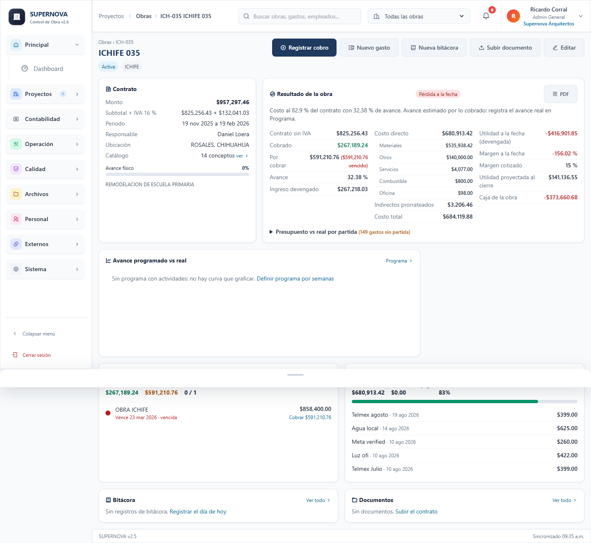

**Nomina por obra.** En Nomina, *Por obra* asigna cada nomina a una obra para que la mano de obra propia entre al costo real. Al registrar una nomina nueva se asigna sola a la obra del empleado.

**Reportes > Resultados y flujo.** Estado de resultados por obra (ingreso, costo directo, indirectos, utilidad y margen) con base caja o devengada, flujo de efectivo del periodo y exportacion a Excel. Sustituye al antiguo Reporte Financiero.

## 3.16 Socios y reparto de utilidades

Solo para administradores (Contabilidad > Socios).

**Socios.** Nombre, usuario vinculado, RFC y porcentaje de participacion; la suma no puede pasar de 100 %. El saldo en cuenta es positivo cuando la empresa le debe al socio.

**Cuenta corriente.** Por socio: aportaciones (dinero que puso o gastos de obra que pago de su bolsa), retiros, gastos personales que pago la empresa, utilidades asignadas y pagadas, con saldo y estado de cuenta en PDF. Las aportaciones por gastos y los gastos personales se generan solos desde Compras; aqui solo se capturan entradas y salidas de dinero directas.

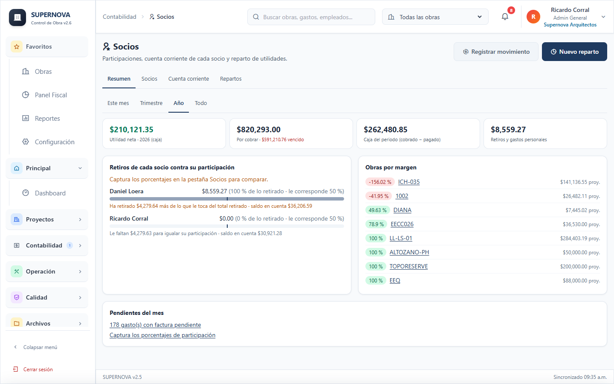

**Reparto de utilidades.** *Nuevo reparto* en cuatro pasos: base (un periodo o una obra terminada), reservas (impuestos y capital de trabajo, configurables), tabla por socio (asignado menos lo retirado a cuenta mas lo aportado, con ajustes justificados) y resumen. El reparto nace *propuesto*; cada socio lo aprueba con su usuario y al aprobar todos pasa a *aprobado* y se registran las utilidades asignadas. *Marcar pagado* registra los pagos por socio. El *Acta* en PDF se guarda en el expediente. Un periodo no puede repartirse dos veces sin anular el anterior.

**Dashboard de socios.** Al entrar, los administradores ven ademas: utilidad neta del ano, por cobrar, caja del ano, lo retirado por cada socio contra su participacion y las obras con margen bajo.

**Configuracion > Finanzas.** Regla de prorrateo de indirectos (partes iguales, proporcional al contrato, al gasto directo o porcentajes fijos), reservas antes de repartir y base del estado de resultados. *Reprocesar indirectos del ano* vuelve a repartir todo con la regla vigente.

---

## 3.17 Dar acceso al cliente

Tu cliente puede seguir su obra por su cuenta, sin llamarte: ve el programa, el avance, las fotos, los
documentos que tu marques, el plan de pagos, lo que ya pago y sus facturas. **Nunca ve costos, gastos,
utilidad ni socios.**

Abre la obra y toca **Acceso del cliente** (arriba a la derecha de la ficha; necesitas ser gerente o
administrador). Hay dos formas de darle entrada y puedes usar las dos a la vez.

**Con usuario y contrasena.** Escribe el nombre de la persona: la aplicacion propone un usuario a
partir de el (*Luis Adrian Lopez* se convierte en `luis.adrian`) y tu puedes cambiarlo. El correo y el
celular son opcionales, para tenerlos a la mano. Al tocar *Dar acceso* se genera una contrasena temporal
y se te muestra junto con el usuario **una sola vez**: copiala o mandala por WhatsApp con el boton que
aparece ahi mismo. La primera vez que entre, la aplicacion le pide cambiarla por una suya.

Las cuentas del portal solo se crean aqui: **tu cliente no puede registrarse por su cuenta**. El usuario
no se repite en toda la plataforma, asi que si el que pediste ya esta tomado te lo dice y te propone otro.

Usa esta forma cuando quieras saber quien entra, cuando sean varias personas (el cliente y su esposa, o
dos socios) o cuando la obra tenga informacion delicada. En la lista ves el usuario de cada quien y
cuando entro, puedes generarle una contrasena nueva (con el icono de la llave) o quitarle el acceso (con
el icono de la persona tachada). Si le quitas su ultima obra, la cuenta se desactiva sola.

Una misma persona puede ver varias obras: dale acceso desde cada obra con el mismo correo y en su
portal le aparece un selector para cambiar de una a otra.

**Con enlace sin contrasena.** Un link privado que abre directo. Es comodo para una obra chica, pero
quien reciba el link entra: si se reenvia, no hay forma de saber quien lo vio. Puedes generar un enlace
nuevo (el anterior deja de servir) o desactivarlo.

**Que documentos ve.** Solo los que marques uno por uno. En el modulo Documentos, prende *Visible para el
cliente* al guardar, o toca el icono del ojo en la lista. Todo lo demas (contratos con proveedores,
cotizaciones, precios de costo) se queda de tu lado.

**Como los ve ordenados.** Los entregables se agrupan por entrega. En Documentos y en Fotos hay un campo
*Entrega del programa*: el hito al que pertenece cada archivo. En el portal, cada entrega es un bloque con
su fecha, cuantos documentos y fotos trae y si ya se entrego, y en el programa de obra cada hito con
material publicado muestra un boton que lleva a su bloque. Asi el cliente no busca entre una lista larga:
entra por la fecha de entrega que le interesa.

**Si el cliente olvida su contrasena** no hay correo de recuperacion: te lo pide a ti y le generas una
nueva desde la misma pantalla. Si lo que olvido es el usuario, lo ves en la lista de esa obra.
